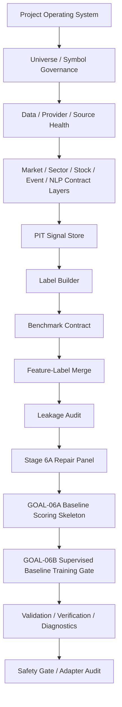

# A Share Premarket Core

Clean private active repository for the A-share pre-market alpha diagnosis and
risk-aware position-building decision support system.

This is not an automatic trading bot and does not provide investment advice. It
is a deterministic, review-only research workflow for PIT-safe data contracts,
label construction, feature-label merging, leakage checks, baseline scoring, the
GOAL-06B supervised baseline training gate, GOAL-06C expanded validation, the
GOAL-06C.5/GOAL-06C.6/GOAL-06C.7 engineering data foundation gates, and the
GOAL-06D/GOAL-06D.1 review-only model comparison/calibration/stability
governance gates, the GOAL-07A design-only risk overlay governance gate, and
the GOAL-07B.0 review-only unlock eligibility gate, the GOAL-07B review-only
risk overlay diagnostic prototype, the GOAL-08A design-only contract gate,
GOAL-STORAGE-01 infrastructure-only local research lake hardening, and the
GOAL-08B.0 review-only unlock eligibility gate, the GOAL-08B non-actionable
recommendation diagnostics prototype, the GOAL-09.0 position-band review-only
unlock eligibility gate, and the GOAL-09 non-actionable position-band
diagnostics prototype, plus the GOAL-09.1 warning review/dashboard-readiness
gate, GOAL-V1-INTEGRITY-01 infrastructure-only artifact-lineage structure
gate, the GOAL-10A design-only future backtest contract gate, the GOAL-10B
review-only recommendation diagnostics backtest, and the GOAL-10B.1
review-only coverage repair diagnostic gate, plus GOAL-DATA-LABEL-01
review-only forward-return label coverage expansion, plus
GOAL-V1-DIAGNOSTIC-COVERAGE-02 review-only multi-symbol diagnostic coverage,
GOAL-10B.2/GOAL-10C review-only bounded diagnostics, and
GOAL-DATA-PROVIDER-02A review-only multi-provider capability probing, plus
GOAL-DATA-PROVIDER-02A.1 review-only network-opt-in provider smoke testing,
GOAL-DATA-PROVIDER-02B review-only source-backed panel evidence, and
GOAL-V1-DIAGNOSTIC-COVERAGE-03 review-only source-backed diagnostic coverage,
GOAL-10B.3 review-only DC03 recommendation revalidation diagnostics,
GOAL-RISK-TIERING-01 review-only risk severity numeric score tiering, and
GOAL-RISK-TIERING-01.1 review-only downside-risk repair, plus
GOAL-QUANT-RESEARCH-01 research-only factor validity diagnostics.

## Repository Roles

- `RyanLu0203/A_share_premarket_core`: clean active source of truth.
- `RyanLu0203/A_share_market_analysis_and_prediction`: historical
  legacy/evidence reference only.

This bootstrap is selective. It is not a mirror migration and does not copy the
legacy implementation tree.

## Quickstart

Supported runtime: Python `>=3.9`. The clean GOAL-06B workflow was verified
under Python `3.9.21` during fresh-clone audit.

```bash
python -m compileall src scripts tests
python -m pytest tests -q
python scripts/run_goal06b_regression_suite.py
python scripts/run_goal06c_expanded_validation.py
python scripts/audit_storage_policy.py
python scripts/build_data_bundle_manifest.py
python scripts/audit_data_bundle_manifest.py
python scripts/audit_data_source_coverage.py
python scripts/audit_provider_failure_classification.py
python scripts/run_goal06c7_provider_ladder_engineering_data_base_expansion.py
python scripts/audit_browser_assisted_provider.py
python scripts/audit_workflow_cleanliness.py
python scripts/run_goal06d_model_comparison_calibration.py
python scripts/audit_goal06d_feature_contract.py
python scripts/audit_goal06d_split.py
python scripts/audit_goal06d_model_comparison.py
python scripts/audit_goal06d_calibration.py
python scripts/audit_goal06d_stability.py
python scripts/audit_goal06d_governance.py
python scripts/audit_goal06d_boundary_locks.py
python scripts/run_goal07a_risk_overlay_design_gate.py
python scripts/audit_goal07a_allowed_input_contract.py
python scripts/audit_goal07a_output_schema.py
python scripts/audit_goal07a_risk_rule_catalog.py
python scripts/audit_goal07a_state_machine.py
python scripts/audit_goal07a_upstream_warning_mapping.py
python scripts/audit_goal07a_governance_boundary.py
python scripts/audit_goal07a_boundary_locks.py
python scripts/audit_goal07a_v2_factor_lock.py
python scripts/run_goal07a1_risk_overlay_design_review_gate.py
python scripts/audit_goal07a1_input_contract_readiness.py
python scripts/audit_goal07a1_output_schema_safety.py
python scripts/audit_goal07a1_rule_convertibility.py
python scripts/audit_goal07a1_state_machine_review.py
python scripts/audit_goal07a1_warning_policy.py
python scripts/audit_goal07a1_boundary_locks.py
python scripts/run_goal07b0_risk_overlay_review_only_unlock_gate.py
python scripts/audit_goal07b0_risk_overlay_review_only_unlock_gate.py
python scripts/run_goal07b_risk_overlay_calculation_prototype.py
python scripts/audit_goal07b_risk_overlay_calculation_prototype.py
python scripts/run_goal08a_recommendation_contract_design_gate.py
python scripts/audit_goal08a_recommendation_contract_design_gate.py
python scripts/run_goal_storage01_local_research_lake_hardening_gate.py
python scripts/audit_goal_storage01_local_research_lake_hardening_gate.py
python scripts/run_goal08b0_recommendation_review_only_unlock_gate.py
python scripts/audit_goal08b0_recommendation_review_only_unlock_gate.py
python scripts/run_goal08b_recommendation_diagnostics_prototype.py
python scripts/audit_goal08b_recommendation_diagnostics_prototype.py
python scripts/run_goal090_position_band_review_only_unlock_gate.py
python scripts/audit_goal090_position_band_review_only_unlock_gate.py
python scripts/run_goal09_position_band_diagnostics_prototype.py
python scripts/audit_goal09_position_band_diagnostics_prototype.py
python scripts/run_goal091_position_band_warning_dashboard_readiness_gate.py
python scripts/audit_goal091_position_band_warning_dashboard_readiness_gate.py
python scripts/run_goal_v1_integrity01_artifact_lineage_structure_gate.py
python scripts/audit_goal_v1_integrity01_artifact_lineage_structure_gate.py
python scripts/run_goal10a_backtest_contract_design_gate.py
python scripts/audit_goal10a_backtest_contract_design_gate.py
python scripts/run_goal10b_recommendation_backtest_review_only.py
python scripts/audit_goal10b_recommendation_backtest_review_only.py
python scripts/run_goal10b1_backtest_coverage_repair_gate.py
python scripts/audit_goal10b1_backtest_coverage_repair_gate.py
python scripts/run_goal_data_label01_forward_return_label_coverage_expansion.py
python scripts/audit_goal_data_label01_forward_return_label_coverage_expansion.py
python scripts/run_goal_v1_diagnostic_coverage02_multi_symbol_diagnostics_expansion.py
python scripts/audit_goal_v1_diagnostic_coverage02_multi_symbol_diagnostics_expansion.py
python scripts/run_goal10b2_recommendation_backtest_revalidation.py
python scripts/audit_goal10b2_recommendation_backtest_revalidation.py
python scripts/run_goal10c_cost_slippage_sensitivity_gate.py
python scripts/audit_goal10c_cost_slippage_sensitivity_gate.py
python scripts/run_goal_data_provider02a_multi_provider_capability_probe_gate.py
python scripts/audit_goal_data_provider02a_multi_provider_capability_probe_gate.py
python scripts/run_goal_data_provider02a1_network_smoke_test.py
python scripts/audit_goal_data_provider02a1_network_smoke_test.py
python scripts/run_goal_data_provider02b_source_backed_panel_build_gate.py
python scripts/audit_goal_data_provider02b_source_backed_panel_build_gate.py
python scripts/run_goal_v1_diagnostic_coverage03_source_backed_diagnostics_gate.py
python scripts/audit_goal_v1_diagnostic_coverage03_source_backed_diagnostics_gate.py
python scripts/run_goal10b3_dc03_recommendation_revalidation_gate.py
python scripts/audit_goal10b3_dc03_recommendation_revalidation_gate.py
python scripts/run_goal_risk_tiering01_risk_severity_numeric_score_gate.py
python scripts/audit_goal_risk_tiering01_risk_severity_numeric_score_gate.py
python scripts/run_goal_risk_tiering011_downside_risk_repair_gate.py
python scripts/audit_goal_risk_tiering011_downside_risk_repair_gate.py
python scripts/run_goal_quant_research01_factor_research_lab_gate.py
python scripts/audit_goal_quant_research01_factor_research_lab_gate.py
python scripts/rebuild_stage6c_from_engineering_panel.py
python scripts/run_goal06c6_source_backed_engineering_pilot_bundle.py
python scripts/run_e2e_trunk_verification_through_goal06b.py
python scripts/run_e2e_trunk_validation_through_goal06b.py
python scripts/run_safety_gate.py
python scripts/run_adapter_audit.py
```

## Active Workflow



This active diagram uses solid arrows only and stops at GOAL-06B. GOAL-06C is
implemented as a review-only validation extension, not as active scoring,
recommendation, or position output.

## Review-Only Validation Extension

```mermaid
flowchart TD
    A["GOAL-06B Supervised Baseline Training Gate"] -. "review-only extension" .-> B["GOAL-06C Expanded Validation Panel<br/>(implemented_review_only)"]
    B -. "review-only ranking" .-> C["Deterministic Ranking Baselines<br/>(implemented_review_only)"]
    C -. "offline evaluation only" .-> D["Rank Metrics + Walk-Forward Diagnostics<br/>(implemented_review_only)"]
    D -. "engineering data gate" .-> E["GOAL-06C.5 Storage + Coverage + Panel Gate<br/>(implemented_review_only)"]
    E -. "source-backed provider gate" .-> G["GOAL-06C.6 AKShare Engineering Pilot Bundle Gate<br/>(implemented_review_only)"]
    G -. "failure taxonomy gate" .-> H["GOAL-06C.6A Scoped Network + Failure Taxonomy<br/>(implemented_review_only)"]
    H -. "provider ladder gate" .-> I["GOAL-06C.7 Provider Ladder Engineering Data Base Expansion<br/>(implemented_review_only)"]
    I -. "engineering_pilot reached; review-only gate" .-> F["GOAL-06D Model Comparison / Calibration / Stability<br/>(implemented_review_only; PASS_WITH_WARNINGS)"]
    F -. "warning repair review-only" .-> I2["GOAL-06D.1 Calibration / Stability Warning Repair<br/>(implemented_review_only; PASS_WITH_WARNINGS)"]
    I2 -. "design-only implemented" .-> J["GOAL-07A Risk Overlay Design<br/>(implemented_design_only; PASS_WITH_WARNINGS)"]
    J -. "design review readiness" .-> J2["GOAL-07A.1 Design Review + Unlock Readiness<br/>(implemented_review_only; PASS_WITH_WARNINGS)"]
    J2 -. "explicit review-only unlock gate" .-> J3["GOAL-07B.0 Unlock Gate<br/>(implemented_review_only; PASS_WITH_WARNINGS)"]
    J3 -. "review-only diagnostic prototype" .-> K["GOAL-07B Risk Overlay Calculation<br/>(implemented_review_only; PASS_WITH_WARNINGS)"]
    K -. "implemented design-only" .-> O["GOAL-08A Recommendation Contract Design<br/>(implemented_design_only; PASS)"]
    O -. "implemented infrastructure-only" .-> S["GOAL-STORAGE-01 Local Research Lake Hardening<br/>(implemented_infrastructure_only; PASS)"]
    S -. "explicit review-only unlock gate" .-> S2["GOAL-08B.0 Unlock Gate<br/>(implemented_review_only; PASS_WITH_WARNINGS)"]
    S2 -. "review-only diagnostics" .-> P["GOAL-08B Recommendation Diagnostics<br/>(implemented_review_only; PASS_WITH_WARNINGS)"]
    P -. "explicit review-only unlock gate" .-> Q0["GOAL-09.0 Position-Band Unlock Gate<br/>(implemented_review_only; PASS_WITH_WARNINGS)"]
    Q0 -. "review-only diagnostics" .-> Q["GOAL-09 Position-Band Diagnostics<br/>(implemented_review_only; PASS_WITH_WARNINGS)"]
    Q -. "warning review / dashboard readiness" .-> Q1["GOAL-09.1 Dashboard Readiness Gate<br/>(implemented_review_only; PASS_WITH_WARNINGS)"]
    Q1 -. "artifact-lineage integrity only" .-> V1["GOAL-V1-INTEGRITY-01 Structure Gate<br/>(implemented_infrastructure_only; PASS_WITH_WARNINGS)"]
    V1 -. "design-only backtest contract" .-> B10A["GOAL-10A Backtest Contract Design<br/>(implemented_design_only; PASS_WITH_WARNINGS)"]
    B10A -. "review-only diagnostics" .-> B10B["GOAL-10B Recommendation Diagnostics Backtest<br/>(implemented_review_only; PASS_WITH_WARNINGS)"]
    B10B -. "coverage repair diagnostics" .-> B10B1["GOAL-10B.1 Coverage Repair Gate<br/>(implemented_review_only; PASS_WITH_WARNINGS)"]
    B10B1 -. "label coverage expansion" .-> DL01["GOAL-DATA-LABEL-01 Forward-Return Label Coverage<br/>(implemented_review_only; PASS_WITH_WARNINGS)"]
    DL01 -. "review-only diagnostics" .-> DC02["GOAL-V1-DIAGNOSTIC-COVERAGE-02 Multi-Symbol Diagnostics<br/>(implemented_review_only; PASS_WITH_WARNINGS)"]
    DC02 -. "review-only revalidation" .-> B10B2["GOAL-10B.2 Recommendation Backtest Revalidation<br/>(implemented_review_only; PASS_WITH_WARNINGS)"]
    B10B2 -. "review-only sensitivity" .-> B10C["GOAL-10C Cost / Slippage Sensitivity<br/>(implemented_review_only; PASS_WITH_WARNINGS)"]
    B10C -. "provider capability probe" .-> P02A["GOAL-DATA-PROVIDER-02A Multi-Provider Capability Probe<br/>(implemented_review_only; PASS_WITH_WARNINGS)"]
    P02A -. "network opt-in smoke test" .-> P02A1["GOAL-DATA-PROVIDER-02A.1 Network Opt-In Provider Smoke Test<br/>(implemented_review_only; PASS_WITH_WARNINGS)"]
    P02A1 -. "source-backed panel gate" .-> P02B["GOAL-DATA-PROVIDER-02B Source-Backed Panel Build<br/>(implemented_review_only; PASS_WITH_WARNINGS)"]
    P02B -. "evaluation panel remains locked" .-> PANEL02["GOAL-DATA-PANEL-02 Evaluation Panel<br/>(locked_future)"]
    P02B -. "source-backed diagnostics" .-> DC03["GOAL-V1-DIAGNOSTIC-COVERAGE-03 Source-Backed Diagnostics<br/>(implemented_review_only; PASS_WITH_WARNINGS)"]
    DC03 -. "review-only revalidation" .-> B10B3["GOAL-10B.3 DC03 Recommendation Revalidation<br/>(implemented_review_only; PASS_WITH_WARNINGS)"]
    B10B3 -. "risk tiering" .-> RISK01["GOAL-RISK-TIERING-01 Risk Severity Numeric Score Tiering<br/>(implemented_review_only; PASS_WITH_WARNINGS)"]
    RISK01 -. "downside repair" .-> RISK011["GOAL-RISK-TIERING-01.1 Downside Risk Repair<br/>(implemented_review_only; PASS_WITH_WARNINGS)"]
    RISK011 -. "research-only factor lab" .-> QRESEARCH01["GOAL-QUANT-RESEARCH-01 Factor Research Lab<br/>(implemented_research_only; PASS_WITH_WARNINGS)"]
    QRESEARCH01 -. "locked future" .-> RECTIER01["GOAL-REC-TIERING-01 Recommendation Score Tiering<br/>(locked_future)"]
    RECTIER01 -. "locked future" .-> B10B4["GOAL-10B.4 Recommendation Revalidation<br/>(locked_future)"]
    B10B4 -. "locked future" .-> PBV01["GOAL-POSITION-BAND-VALIDATION-01<br/>(locked_future)"]
    B10C -. "locked future" .-> B10D["GOAL-10D Failure Attribution<br/>(locked_future)"]
    V1 -. "dashboard UI locked" .-> DASH["Dashboard / Daily Report UI<br/>(locked_future)"]
```



GOAL-06C ranks are audit artifacts only. They are not recommendations, buy/sell
signals, position bands, portfolio weights, or production model outputs.
GOAL-06C.5 originally classified the small clean-bootstrap panel as
`contract_demo`: 8 rows, 4 trading dates, and 2 approved symbols.
GOAL-06C.6 adds compliant AKShare/source-backed ingestion infrastructure.
Network ingestion is disabled by default and requires `ASHARE_ALLOW_NETWORK_INGESTION=1`
or `--allow-network`. It classifies provider failures on the default AKShare
path.
GOAL-06C.6A adds finance-only network isolation evidence and a provider failure
taxonomy that separates ProxyError, timeout, DNS, TLS, connection reset/refused,
HTTP access, anti-bot/challenge, schema, parser, data-quality, PIT/label,
storage, and workflow-governance failures. Network failures must not be
collapsed into a generic class when a specific class can be determined.
It also includes an explicit CloakBrowser reference probe that is optional,
tag-only, sanitized, and separate from the default provider path. That probe may
label a current access problem as solved only when it produces matching
domain-access or structured-ingestion evidence.
GOAL-06C.7 adds a deterministic provider ladder:
`akshare_direct`, `browser_assisted_optional`, `local_import`, and
`future_vendor_data_placeholder`. Browser-assisted ingestion remains disabled by
default and requires both `ASHARE_ENABLE_BROWSER_ASSISTED_PROVIDER=1` and
`--enable-browser-assisted`. It is finance-domain-only, dynamic-import-only,
stores no raw browser artifacts, and counts only schema-valid rows. Domain
access alone is tagged separately. The latest explicit network-enabled
GOAL-06C.7 run reached `engineering_pilot` with 50 approved symbols, 120
validation trading dates, and 6000 usable rows. GOAL-06D has now run only as a
review-only model comparison/calibration/stability/governance gate. It is
`PASS_WITH_WARNINGS`, selected `score_based_alpha_ranking` as a weak
review-only baseline. GOAL-06D.1 repairs those warnings only as review-only
diagnostics and allows GOAL-07A only as design-only preparation with warnings.
GOAL-07A is now `implemented_design_only`; it defines contracts, future schema,
rule catalog, state machine, upstream-warning mapping, and governance audits
only. It does not calculate risk values or unlock recommendation, position,
dashboard, paper/live trading, production, factor mining, or DQN/RL.
GOAL-07A.1 is implemented as a review-only design review gate. It classifies upstream warnings, checks forbidden schema overlap, reviews rule/state-machine convertibility, and writes a GOAL-07B unlock readiness manifest. GOAL-07B.0 is implemented as the explicit review-only unlock gate. GOAL-07B is now implemented only as a review-only risk overlay diagnostic prototype: it writes non-actionable `trade_date + symbol` diagnostics, propagates upstream warnings, and does not create recommendation, position, dashboard, paper/live trading, production, backtest, factor-mining, broker, or DQN/RL outputs. GOAL-08A is implemented only as a design-only names-only contract gate with zero recommendation rows. GOAL-STORAGE-01 is infrastructure-only local research lake hardening; it defines storage root, directory, manifest, checksum, schema, and GitHub hygiene rules and does not unlock GOAL-08B by itself. GOAL-08B.0 is implemented as an unlock-only review gate based on prior GOAL-07B, GOAL-08A, and GOAL-STORAGE-01 PASS/PASS_WITH_WARNINGS evidence. GOAL-08B is now implemented only as a review-only non-actionable recommendation diagnostics prototype: it writes 100 deterministic `trade_date + symbol` diagnostic rows, all with `actionability_status=never_actionable`, and it does not create actionable recommendations, buy/sell/hold outputs, target prices, expected returns for action, position sizing, portfolio weights, dashboards, trading, production, backtest, factor-mining, broker, local-lake, or DQN/RL outputs. GOAL-09.0 is implemented as an unlock-only review gate based on prior GOAL-08B and upstream PASS/PASS_WITH_WARNINGS evidence. GOAL-09 is now implemented only as a review-only non-actionable position-band diagnostics prototype: it writes deterministic `trade_date + symbol` diagnostic rows, keeps `position_actionability_status=never_actionable`, and does not create actual position rows, position sizing, portfolio weights, target weights, order quantities, buy/sell/hold outputs, target prices, dashboards, trading, production, backtests, factor-mining, broker, local-lake, or DQN/RL outputs. GOAL-09.1 is implemented only as a review/readiness warning-classification gate for future dashboard contract design. GOAL-V1-INTEGRITY-01 is implemented only as an infrastructure artifact-lineage and structure gate over GOAL-07B, GOAL-08B, GOAL-09, and GOAL-09.1 evidence. GOAL-10A is implemented only as a design-only future backtest contract gate from GOAL-08B and GOAL-09 diagnostics; it defines inputs, date alignment, T+1/no-lookahead rules, future metrics, grouping, cost/slippage sensitivity, benchmark leakage blockers, and suspended/limit/missing-price policy, but runs no backtest and creates no backtest rows. GOAL-10B is implemented only as a review-only, non-actionable recommendation diagnostics backtest over GOAL-08B rows and existing PIT-safe forward-return labels; it writes grouped diagnostic metrics and IC/RankIC availability evidence only. Dashboard / Daily Report UI remains `locked_future`.

GOAL-10B.1 is implemented only as review-only coverage repair diagnostics. It
records that current artifacts cannot repair GOAL-10B coverage/group variation,
writes no repaired snapshots or repaired metrics, and does not itself unlock
GOAL-10C. In the current state GOAL-10C has proceeded only as review-only
non-actionable row-level sensitivity diagnostics; GOAL-10D, Dashboard / Daily
Report UI, portfolio backtests, trading, production, factor-mining, local-lake,
broker, and DQN/RL remain locked.

GOAL-DATA-LABEL-01 is implemented only as review-only forward-return label
coverage expansion from existing committed OHLCV and benchmark samples. It
writes 100 deterministic label rows with 1d, 3d, 5d, and 20d stock,
benchmark, and excess-return fields where future bars exist; 80 rows are
20d-label-ready. The current expanded labels remain single-symbol and do not
yet overlap GOAL-08B/GOAL-09 diagnostics.

GOAL-V1-DIAGNOSTIC-COVERAGE-02 is implemented only as review-only
multi-symbol diagnostic coverage from existing committed Stage 6C
approved-symbol evidence. It writes 8 non-actionable risk, recommendation, and
position-band diagnostic rows per family, preserves canonical GOAL-07B/08B/09
artifacts, and does not run production backtests. GOAL-10B.2 is implemented
only as review-only recommendation backtest revalidation over those DC02 rows:
it writes an 8-row snapshot plus recommendation-status, symbol, and
horizon-coverage diagnostics. GOAL-10C is implemented only as review-only
position-band cost/slippage sensitivity: it writes 8 input rows, 24 row-level
sensitivity rows, and 3 group metric rows. GOAL-10D, dashboard, trading,
production, local-lake, factor-mining, broker, and DQN/RL remain locked.
GOAL-DATA-PROVIDER-02A is implemented only as a review-only multi-provider
capability probe for Tushare Pro, Baostock, AkShare, efinance, qstock,
yfinance auxiliary, and local import fallback. It writes provider metadata only
and does not build a final evaluation panel. GOAL-DATA-PROVIDER-02A.1 is
implemented only as a review-only network-opt-in smoke test: live provider
access is attempted only with `ASHARE_ALLOW_NETWORK_INGESTION=1`, Tushare Pro
also requires `ASHARE_ALLOW_TUSHARE=1` plus `TUSHARE_TOKEN` from the
environment, and no provider tokens or raw provider payloads are persisted.
GOAL-DATA-PROVIDER-02B is implemented only as a review-only source-backed
evaluation panel build gate: it writes bounded normalized panel evidence plus
coverage, provider-usage, failure-taxonomy, manifest, report, and audit files,
but it creates no diagnostics, backtests, portfolios, dashboards, trading,
production, local-lake, broker, factor-mining, or DQN/RL outputs.
GOAL-V1-DIAGNOSTIC-COVERAGE-03 is implemented only as review-only
source-backed diagnostic coverage over the 02B panel: it writes separate
non-actionable risk, recommendation eligibility, and position-band diagnostics
at `trade_date + symbol` grain and preserves canonical GOAL-07B/08B/09
artifacts. GOAL-10B.3 is implemented only as review-only DC03 recommendation
revalidation diagnostics: it joins the DC03 recommendation/risk rows to the
Provider02B panel, writes group, symbol, horizon, and imbalance diagnostics,
and records `recommendation_revalidation_signal_weak_or_unreliable` because
the groups are severely imbalanced and no numeric recommendation score exists
for IC/RankIC. GOAL-RISK-TIERING-01 is implemented only as separate
non-actionable risk-tier diagnostics over DC03 and Provider02B evidence. It
writes 6000 risk-tiered rows, excludes future returns from score construction,
uses forward returns only for post-hoc group evaluation, and currently
classifies the tiering signal as weak or unreliable. GOAL-RISK-TIERING-01.1 is
implemented only as separate non-actionable downside-risk repair diagnostics:
it reconstructs component contributions, keeps volatility/momentum flags
separate from downside score construction, excludes future returns from score
construction, and classifies the downside signal as weak or unreliable.
GOAL-QUANT-RESEARCH-01 is implemented only as a research-only factor lab and
score validity gate over committed Provider02B, DC03, GOAL-10B.3,
GOAL-RISK-TIERING-01, and GOAL-RISK-TIERING-01.1 evidence. It writes factor
registry, evaluation, IC/RankIC, monotonicity, rolling stability, trial
registry, and score-validity diagnostics only; it creates no recommendation,
position, portfolio, dashboard, trading, production, local-lake, broker,
factor-mining, or DQN/RL outputs.
GOAL-REC-TIERING-01, GOAL-10B.4, position-band validation, GOAL-DATA-PANEL-02,
and GOAL-10D remain `locked_future`.

## Required Public Commands

The target repo preserves the active GOAL-06B command surface and GOAL-06C
review-only validation wrappers:

- `python scripts/audit_existing_modules.py`
- `python scripts/build_pit_signal_snapshot.py`
- `python scripts/audit_pit_signal_snapshot.py`
- `python scripts/build_label_snapshot.py`
- `python scripts/audit_label_snapshot.py`
- `python scripts/build_model_ready_candidate_dataset.py`
- `python scripts/audit_feature_label_leakage.py`
- `python scripts/run_stage6a_blocker_repair.py --no-network`
- `python scripts/run_baseline_scoring_skeleton.py`
- `python scripts/audit_baseline_scoring_skeleton.py`
- `python scripts/run_supervised_baseline_training.py`
- `python scripts/audit_supervised_baseline_training.py`
- `python scripts/build_stage6c_expanded_validation_dataset.py`
- `python scripts/audit_stage6c_expanded_validation.py`
- `python scripts/run_stage6c_ranking_baselines.py`
- `python scripts/audit_stage6c_ranking_baselines.py`
- `python scripts/run_stage6c_walk_forward_validation.py`
- `python scripts/run_goal06c_expanded_validation.py`
- `python scripts/audit_storage_policy.py`
- `python scripts/build_data_bundle_manifest.py`
- `python scripts/audit_data_bundle_manifest.py`
- `python scripts/audit_data_source_coverage.py`
- `python scripts/audit_provider_failure_classification.py`
- `python scripts/run_akshare_engineering_pilot_ingestion.py`
- `python scripts/run_goal06c7_provider_ladder_engineering_data_base_expansion.py`
- `ASHARE_ENABLE_BROWSER_ASSISTED_PROVIDER=1 python scripts/run_browser_assisted_finance_ingestion.py --allow-network --enable-browser-assisted`
- `python scripts/audit_browser_assisted_provider.py`
- `python scripts/audit_workflow_cleanliness.py`
- `python scripts/run_goal06d_model_comparison_calibration.py`
- `python scripts/audit_goal06d_feature_contract.py`
- `python scripts/audit_goal06d_split.py`
- `python scripts/audit_goal06d_model_comparison.py`
- `python scripts/audit_goal06d_calibration.py`
- `python scripts/audit_goal06d_stability.py`
- `python scripts/audit_goal06d_governance.py`
- `python scripts/audit_goal06d_boundary_locks.py`
- `python scripts/run_goal07a_risk_overlay_design_gate.py`
- `python scripts/audit_goal07a_allowed_input_contract.py`
- `python scripts/audit_goal07a_output_schema.py`
- `python scripts/audit_goal07a_risk_rule_catalog.py`
- `python scripts/audit_goal07a_state_machine.py`
- `python scripts/audit_goal07a_upstream_warning_mapping.py`
- `python scripts/audit_goal07a_governance_boundary.py`
- `python scripts/audit_goal07a_boundary_locks.py`
- `python scripts/audit_goal07a_v2_factor_lock.py`
- `python scripts/run_goal07a1_risk_overlay_design_review_gate.py`
- `python scripts/audit_goal07a1_input_contract_readiness.py`
- `python scripts/audit_goal07a1_output_schema_safety.py`
- `python scripts/audit_goal07a1_rule_convertibility.py`
- `python scripts/audit_goal07a1_state_machine_review.py`
- `python scripts/audit_goal07a1_warning_policy.py`
- `python scripts/audit_goal07a1_boundary_locks.py`
- `python scripts/run_goal07b0_risk_overlay_review_only_unlock_gate.py`
- `python scripts/audit_goal07b0_risk_overlay_review_only_unlock_gate.py`
- `python scripts/run_goal07b_risk_overlay_calculation_prototype.py`
- `python scripts/audit_goal07b_risk_overlay_calculation_prototype.py`
- `python scripts/run_goal08a_recommendation_contract_design_gate.py`
- `python scripts/audit_goal08a_recommendation_contract_design_gate.py`
- `python scripts/run_goal_storage01_local_research_lake_hardening_gate.py`
- `python scripts/audit_goal_storage01_local_research_lake_hardening_gate.py`
- `python scripts/run_goal08b0_recommendation_review_only_unlock_gate.py`
- `python scripts/audit_goal08b0_recommendation_review_only_unlock_gate.py`
- `python scripts/run_goal08b_recommendation_diagnostics_prototype.py`
- `python scripts/audit_goal08b_recommendation_diagnostics_prototype.py`
- `python scripts/run_goal090_position_band_review_only_unlock_gate.py`
- `python scripts/audit_goal090_position_band_review_only_unlock_gate.py`
- `python scripts/run_goal09_position_band_diagnostics_prototype.py`
- `python scripts/audit_goal09_position_band_diagnostics_prototype.py`
- `python scripts/run_goal091_position_band_warning_dashboard_readiness_gate.py`
- `python scripts/audit_goal091_position_band_warning_dashboard_readiness_gate.py`
- `python scripts/run_goal_v1_integrity01_artifact_lineage_structure_gate.py`
- `python scripts/audit_goal_v1_integrity01_artifact_lineage_structure_gate.py`
- `python scripts/run_goal10a_backtest_contract_design_gate.py`
- `python scripts/audit_goal10a_backtest_contract_design_gate.py`
- `python scripts/run_goal10b_recommendation_backtest_review_only.py`
- `python scripts/audit_goal10b_recommendation_backtest_review_only.py`
- `python scripts/run_goal10b1_backtest_coverage_repair_gate.py`
- `python scripts/audit_goal10b1_backtest_coverage_repair_gate.py`
- `python scripts/run_goal_data_label01_forward_return_label_coverage_expansion.py`
- `python scripts/audit_goal_data_label01_forward_return_label_coverage_expansion.py`
- `python scripts/run_goal_v1_diagnostic_coverage02_multi_symbol_diagnostics_expansion.py`
- `python scripts/audit_goal_v1_diagnostic_coverage02_multi_symbol_diagnostics_expansion.py`
- `python scripts/run_goal10b2_recommendation_backtest_revalidation.py`
- `python scripts/audit_goal10b2_recommendation_backtest_revalidation.py`
- `python scripts/run_goal10c_cost_slippage_sensitivity_gate.py`
- `python scripts/audit_goal10c_cost_slippage_sensitivity_gate.py`
- `python scripts/run_goal_data_provider02a_multi_provider_capability_probe_gate.py`
- `python scripts/audit_goal_data_provider02a_multi_provider_capability_probe_gate.py`
- `python scripts/run_goal_data_provider02a1_network_smoke_test.py`
- `python scripts/audit_goal_data_provider02a1_network_smoke_test.py`
- `python scripts/run_goal_data_provider02b_source_backed_panel_build_gate.py`
- `python scripts/audit_goal_data_provider02b_source_backed_panel_build_gate.py`
- `python scripts/run_goal_v1_diagnostic_coverage03_source_backed_diagnostics_gate.py`
- `python scripts/audit_goal_v1_diagnostic_coverage03_source_backed_diagnostics_gate.py`
- `python scripts/run_goal10b3_dc03_recommendation_revalidation_gate.py`
- `python scripts/audit_goal10b3_dc03_recommendation_revalidation_gate.py`
- `python scripts/run_goal_risk_tiering01_risk_severity_numeric_score_gate.py`
- `python scripts/audit_goal_risk_tiering01_risk_severity_numeric_score_gate.py`
- `python scripts/run_goal_risk_tiering011_downside_risk_repair_gate.py`
- `python scripts/audit_goal_risk_tiering011_downside_risk_repair_gate.py`
- `python scripts/run_goal_quant_research01_factor_research_lab_gate.py`
- `python scripts/audit_goal_quant_research01_factor_research_lab_gate.py`
- `python scripts/build_engineering_pilot_universe.py`
- `python scripts/build_source_backed_local_bundle.py`
- `python scripts/audit_source_backed_local_bundle.py`
- `python scripts/build_source_backed_pit_signal_panel.py`
- `python scripts/build_source_backed_label_panel.py`
- `python scripts/rebuild_stage6c_source_backed_engineering_panel.py`
- `python scripts/audit_stage6c_source_backed_engineering_panel.py`
- `python scripts/run_goal06c6_source_backed_engineering_pilot_bundle.py`
- `python scripts/build_engineering_pit_signal_panel.py`
- `python scripts/audit_engineering_pit_signal_panel.py`
- `python scripts/build_engineering_label_panel.py`
- `python scripts/audit_engineering_label_panel.py`
- `python scripts/rebuild_stage6c_from_engineering_panel.py`
- `python scripts/run_current_trunk_validation.py`
- `python scripts/run_program_validation_profile.py`
- `python scripts/run_safety_gate.py`
- `python scripts/run_adapter_audit.py`
- `python scripts/run_workflow_diagnostics.py`
- `python scripts/audit_workflow_status.py`
- `python scripts/run_cloakbrowser_reference_probe.py`

## Protected Outputs

The active evidence chain is regenerated locally and committed only as concise,
sanitized CSV/Markdown/JSON artifacts. Raw provider payloads, raw HTML, full news
text, DBs, notebooks, caches, private logs, dashboards, and model artifacts for
production promotion are forbidden.

Stable committed reports do not store volatile wall-clock timings. Runtime
details are preserved in ignored local diagnostics under `outputs/local/runtime/`.

GOAL-06C.6A provider failure evidence is stored as sanitized metadata only:

- `outputs/audits/provider_failure_events.csv`
- `outputs/audits/provider_failure_summary.md`
- `outputs/audits/provider_failure_summary.json`
- `outputs/audits/goal06c6_network_isolation_report.md`
- `outputs/audits/goal06c6_failure_taxonomy_report.md`
- `outputs/audits/cloakbrowser_reference_problem_tags.csv`
- `outputs/audits/cloakbrowser_reference_probe_results.csv`
- `outputs/audits/cloakbrowser_reference_ingestion_report.md`
- `outputs/audits/cloakbrowser_reference_ingestion_report.json`
- `outputs/audits/browser_assisted_provider_events.csv`
- `outputs/audits/browser_assisted_provider_audit.md`
- `outputs/audits/browser_assisted_provider_audit.json`
- `outputs/audits/workflow_cleanliness_audit.md`
- `outputs/audits/goal06c7_readiness_report.md`
- `outputs/models/goal06d/model_comparison_summary.csv`
- `outputs/models/goal06d/calibration_summary.csv`
- `outputs/models/goal06d/stability_summary.csv`
- `outputs/audits/goal06d_readiness_report.md`
- `outputs/audits/goal06d_governance_audit.md`
- `outputs/audits/goal06d_boundary_lock_audit.md`
- `outputs/audits/goal07a_readiness_report.md`
- `outputs/audits/goal07a_governance_boundary_audit.md`
- `outputs/audits/goal07a_boundary_lock_audit.md`
- `outputs/audits/goal07a1_design_review_report.md`
- `outputs/audits/goal07a1_unlock_readiness_manifest.json`
- `outputs/audits/goal07b0_unlock_gate_report.md`
- `outputs/audits/goal07b0_unlock_gate_manifest.json`
- `outputs/audits/goal07b0_unlock_gate_audit_report.md`
- `outputs/risk_overlay/goal07b_review_only_risk_overlay.csv`
- `outputs/diagnostics/goal07b_risk_overlay_diagnostics.csv`
- `outputs/audits/goal07b_risk_overlay_calculation_report.md`
- `outputs/audits/goal07b_risk_overlay_calculation_manifest.json`
- `outputs/audits/goal07b_risk_overlay_calculation_audit.md`
- `configs/recommendation/goal08a_future_recommendation_input_contract.yaml`
- `configs/recommendation/goal08a_future_recommendation_schema.yaml`
- `configs/recommendation/goal08a_warning_propagation_policy.yaml`
- `configs/recommendation/goal08a_actionability_guardrails.yaml`
- `configs/recommendation/goal08a_recommendation_state_machine.yaml`
- `outputs/audits/goal08a_recommendation_contract_design_report.md`
- `outputs/audits/goal08a_recommendation_contract_design_manifest.json`
- `outputs/audits/goal08a_recommendation_contract_design_audit.md`
- `configs/storage/goal_storage01_local_research_lake_contract.yaml`
- `docs/storage/GOAL_STORAGE01_LOCAL_RESEARCH_LAKE_HARDENING_GATE.md`
- `outputs/audits/goal_storage01_local_research_lake_hardening_report.md`
- `outputs/audits/goal_storage01_local_research_lake_hardening_manifest.json`
- `outputs/audits/goal_storage01_local_research_lake_hardening_audit.md`
- `configs/recommendation/goal08b0_review_only_unlock_policy.yaml`
- `docs/recommendation/GOAL08B0_RECOMMENDATION_REVIEW_ONLY_UNLOCK_GATE.md`
- `outputs/audits/goal08b0_recommendation_review_only_unlock_report.md`
- `outputs/audits/goal08b0_recommendation_review_only_unlock_manifest.json`
- `outputs/audits/goal08b0_recommendation_review_only_unlock_audit.md`
- `configs/recommendation/goal08b_review_only_diagnostics_policy.yaml`
- `docs/recommendation/GOAL08B_REVIEW_ONLY_RECOMMENDATION_DIAGNOSTICS.md`
- `outputs/recommendation/goal08b_review_only_recommendation_diagnostics.csv`
- `outputs/audits/goal08b_recommendation_diagnostics_report.md`
- `outputs/audits/goal08b_recommendation_diagnostics_manifest.json`
- `outputs/audits/goal08b_recommendation_diagnostics_audit.md`
- `configs/position/goal090_position_band_review_only_unlock_policy.yaml`
- `docs/position/GOAL090_POSITION_BAND_REVIEW_ONLY_UNLOCK_GATE.md`
- `outputs/audits/goal090_position_band_review_only_unlock_report.md`
- `outputs/audits/goal090_position_band_review_only_unlock_manifest.json`
- `outputs/audits/goal090_position_band_review_only_unlock_audit.md`
- `configs/position/goal09_review_only_position_band_diagnostics_policy.yaml`
- `docs/position/GOAL09_REVIEW_ONLY_POSITION_BAND_DIAGNOSTICS.md`
- `outputs/position/goal09_review_only_position_band_diagnostics.csv`
- `outputs/audits/goal09_position_band_diagnostics_report.md`
- `outputs/audits/goal09_position_band_diagnostics_manifest.json`
- `outputs/audits/goal09_position_band_diagnostics_audit.md`
- `configs/dashboard/goal091_dashboard_readiness_warning_policy.yaml`
- `docs/dashboard/GOAL091_POSITION_BAND_WARNING_REVIEW_AND_DASHBOARD_READINESS.md`
- `outputs/audits/goal091_dashboard_readiness_report.md`
- `outputs/audits/goal091_dashboard_readiness_manifest.json`
- `outputs/audits/goal091_dashboard_readiness_audit.md`
- `configs/validation/goal_v1_integrity01_artifact_lineage_contract.yaml`
- `docs/validation/GOAL_V1_INTEGRITY01_ARTIFACT_LINEAGE_STRUCTURE_GATE.md`
- `outputs/audits/goal_v1_integrity01_artifact_lineage_structure_report.md`
- `outputs/audits/goal_v1_integrity01_artifact_lineage_structure_manifest.json`
- `outputs/audits/goal_v1_integrity01_artifact_lineage_structure_audit.md`
- `configs/backtest/goal10a_backtest_input_contract.yaml`
- `configs/backtest/goal10a_backtest_metric_contract.yaml`
- `configs/backtest/goal10a_backtest_grouping_contract.yaml`
- `configs/backtest/goal10a_execution_alignment_policy.yaml`
- `docs/backtest/GOAL10A_BACKTEST_CONTRACT_DESIGN_GATE.md`
- `outputs/audits/goal10a_backtest_contract_design_report.md`
- `outputs/audits/goal10a_backtest_contract_design_manifest.json`
- `outputs/audits/goal10a_backtest_contract_design_audit.md`
- `docs/backtest/GOAL10B_RECOMMENDATION_BACKTEST_REVIEW_ONLY.md`
- `outputs/backtest/goal10b_recommendation_backtest_input_snapshot.csv`
- `outputs/backtest/goal10b_recommendation_group_metrics.csv`
- `outputs/backtest/goal10b_risk_severity_group_metrics.csv`
- `outputs/backtest/goal10b_warning_group_metrics.csv`
- `outputs/backtest/goal10b_ic_rank_ic_summary.csv`
- `outputs/audits/goal10b_recommendation_backtest_report.md`
- `outputs/audits/goal10b_recommendation_backtest_manifest.json`
- `outputs/audits/goal10b_recommendation_backtest_audit.md`
- `docs/backtest/GOAL10B1_BACKTEST_COVERAGE_REPAIR_GATE.md`
- `outputs/backtest/goal10b1_coverage_repair_diagnostic_summary.csv`
- `outputs/backtest/goal10b1_recommendation_distribution_audit.csv`
- `outputs/backtest/goal10b1_label_source_coverage_audit.csv`
- `outputs/audits/goal10b1_backtest_coverage_repair_report.md`
- `outputs/audits/goal10b1_backtest_coverage_repair_manifest.json`
- `outputs/audits/goal10b1_backtest_coverage_repair_audit.md`
- `outputs/labels/goal_data_label01_forward_return_label_coverage_sample.csv`
- `outputs/labels/goal_data_label01_forward_return_label_coverage_summary.csv`
- `docs/labels/GOAL_DATA_LABEL01_FORWARD_RETURN_LABEL_COVERAGE_EXPANSION.md`
- `outputs/audits/goal_data_label01_forward_return_label_coverage_report.md`
- `outputs/audits/goal_data_label01_forward_return_label_coverage_manifest.json`
- `outputs/audits/goal_data_label01_forward_return_label_coverage_audit.md`
- `outputs/diagnostics/goal_v1_diagnostic_coverage02_risk_diagnostics.csv`
- `outputs/diagnostics/goal_v1_diagnostic_coverage02_recommendation_diagnostics.csv`
- `outputs/diagnostics/goal_v1_diagnostic_coverage02_position_band_diagnostics.csv`
- `outputs/diagnostics/goal_v1_diagnostic_coverage02_coverage_summary.csv`
- `docs/diagnostics/GOAL_V1_DIAGNOSTIC_COVERAGE02_MULTI_SYMBOL_DIAGNOSTICS_EXPANSION.md`
- `outputs/audits/goal_v1_diagnostic_coverage02_multi_symbol_diagnostics_report.md`
- `outputs/audits/goal_v1_diagnostic_coverage02_multi_symbol_diagnostics_manifest.json`
- `outputs/audits/goal_v1_diagnostic_coverage02_multi_symbol_diagnostics_audit.md`

## Lock Boundary

Recommendation, position sizing, dashboard, paper trading, broker/live trading,
production DB writes, production model promotion, backtests, V2 factor mining,
and DQN/RL remain locked. GOAL-07A is implemented only as design-only
governance; GOAL-07B is implemented only as a review-only diagnostic prototype.
GOAL-08A is implemented only as a design-only names-only contract gate with
zero recommendation rows. GOAL-STORAGE-01 is infrastructure-only storage
hardening and does not materialize a data lake, fetch broader data, or unlock
GOAL-08B by itself. GOAL-08B.0 is unlock-only evidence. GOAL-08B is
implemented only as non-actionable review-only diagnostics. GOAL-09.0 is
unlock-only evidence. GOAL-09 is implemented only as non-actionable
review-only position-band diagnostics. GOAL-09.1 is warning review and
dashboard-readiness evidence only. GOAL-V1-INTEGRITY-01 is infrastructure-only
and generates no new risk, recommendation, position, dashboard, or execution
rows. GOAL-10A is design-only contract evidence for future review-only backtest
validation; it runs no backtest and generates no performance rows, equity
curves, portfolio returns, or cost/slippage outputs. GOAL-10B is review-only
diagnostic evidence over GOAL-08B and existing PIT-safe forward-return labels;
it does not generate actions, portfolios, equity curves, dashboards, trading,
production, factor-mining, local-lake, broker, or DQN/RL outputs. GOAL-10B.1
is review-only coverage repair diagnostics; it records that current artifacts
cannot repair coverage/group variation and creates no repaired rows or metrics.
GOAL-DATA-LABEL-01 is review-only label coverage expansion from committed
samples only; it creates no new diagnostics, backtests, portfolios, dashboards,
local-lake data, trading, production, broker, factor-mining, or DQN/RL outputs.
GOAL-V1-DIAGNOSTIC-COVERAGE-02 is review-only multi-symbol diagnostic coverage
from committed Stage 6C approved-symbol evidence only; it creates no actionable
recommendations, positions, portfolios, dashboards, local-lake data, trading,
production, broker, factor-mining, or DQN/RL outputs. GOAL-10B.2 is
review-only recommendation revalidation diagnostics over DC02 rows, and
GOAL-10C is review-only row-level position-band cost/slippage sensitivity.
GOAL-DATA-PROVIDER-02A is review-only provider capability metadata only.
GOAL-DATA-PROVIDER-02A.1 is review-only network-opt-in provider smoke-test
metadata only; it is not provider selection, final panel evidence, diagnostics,
backtest evidence, dashboard evidence, or an execution unlock. GOAL-10D and
GOAL-DASHBOARD-00 remain `locked_future`.
Dashboard / Daily Report UI remains `locked_future`. Actionable recommendations, actual
position rows, position sizing,
dashboards, trading, production, portfolio backtests, factor-mining, broker integration,
local-lake writes, and DQN/RL remain locked.

GOAL-06D.1 is the review-only warning repair layer for those GOAL-06D warnings.
It tests PIT-safe score variants, target horizons, calibration reliability,
feature sign stability, and provider concentration disclosure. GOAL-07A carries
those warnings into design-only risk governance; GOAL-07B carries them into
non-actionable risk diagnostics. No recommendation, position, dashboard,
trading, production, factor-mining, or DQN/RL outputs are produced.

V2 factor research is planned but inactive. The placeholder contract is locked,
disabled in V1, and forbids factor mining, IC/RankIC mining, factor library
generation, factor-to-model integration, and factor-to-recommendation
integration.

## Workflow Promotion Rule

A future workflow block can only be promoted from dotted/future to
solid/implemented if:

1. The corresponding goal has a readiness report.
2. The readiness report is `PASS` or acceptable `PASS_WITH_WARNINGS`.
3. Validation and verification commands pass.
4. `configs/project/workflow_status.csv` is updated.
5. README and architecture diagrams are updated.
6. `PROJECT_STATE.md` is updated.
7. Locked downstream modules remain locked unless explicitly unlocked by that
   goal.

Do not silently change the workflow diagram to make future stages look
implemented. Do not add new downstream blocks without updating
`workflow_status.csv`. Do not remove locks from downstream recommendation,
dashboard, paper/live trading, production, backtest, factor-mining, or DQN/RL
unless a later explicit gate allows it.
