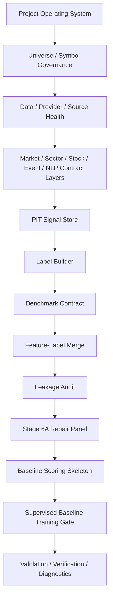

# A Share Premarket Core

Clean private active repository for the A-share pre-market alpha diagnosis and
risk-aware position-building decision support system.

This is not an automatic trading bot and does not provide investment advice. It
is a deterministic, review-only research workflow for PIT-safe data contracts,
label construction, feature-label merging, leakage checks, baseline scoring, and
the GOAL-06B supervised baseline training gate.

## Repository Roles

- `RyanLu0203/A_share_premarket_core`: clean active source of truth.
- `RyanLu0203/A_share_market_analysis_and_prediction`: historical
  legacy/evidence reference only.

This bootstrap is selective. It is not a mirror migration and does not copy the
legacy implementation tree.

## Quickstart

Supported runtime: Python `>=3.9`. The clean GOAL-06B workflow was verified
under Python `3.9.21` during fresh-clone audit.

```bash
python -m compileall src scripts tests
python -m pytest tests -q
python scripts/run_goal06b_regression_suite.py
python scripts/run_e2e_trunk_verification_through_goal06b.py
python scripts/run_e2e_trunk_validation_through_goal06b.py
python scripts/run_safety_gate.py
python scripts/run_adapter_audit.py
```

## Active Workflow



## Required Public Commands

The target repo preserves the active GOAL-06B command surface:

- `python scripts/audit_existing_modules.py`
- `python scripts/build_pit_signal_snapshot.py`
- `python scripts/audit_pit_signal_snapshot.py`
- `python scripts/build_label_snapshot.py`
- `python scripts/audit_label_snapshot.py`
- `python scripts/build_model_ready_candidate_dataset.py`
- `python scripts/audit_feature_label_leakage.py`
- `python scripts/run_stage6a_blocker_repair.py --no-network`
- `python scripts/run_baseline_scoring_skeleton.py`
- `python scripts/audit_baseline_scoring_skeleton.py`
- `python scripts/run_supervised_baseline_training.py`
- `python scripts/audit_supervised_baseline_training.py`
- `python scripts/run_current_trunk_validation.py`
- `python scripts/run_program_validation_profile.py`
- `python scripts/run_safety_gate.py`
- `python scripts/run_adapter_audit.py`
- `python scripts/run_workflow_diagnostics.py`

## Protected Outputs

The active evidence chain is regenerated locally and committed only as concise,
sanitized CSV/Markdown/JSON artifacts. Raw provider payloads, raw HTML, full news
text, DBs, notebooks, caches, private logs, dashboards, and model artifacts for
production promotion are forbidden.

Stable committed reports do not store volatile wall-clock timings. Runtime
details are preserved in ignored local diagnostics under `outputs/local/runtime/`.

## Lock Boundary

Recommendation, risk overlay calculation, dashboard, paper trading,
broker/live trading, production DB writes, production model promotion, and
DQN/RL remain locked. GOAL-06C is future work only unless the clean bootstrap
readiness report explicitly unlocks it.
