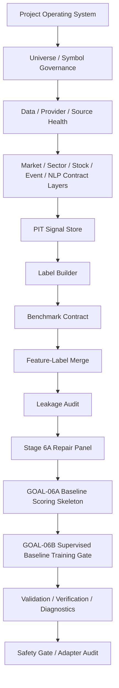
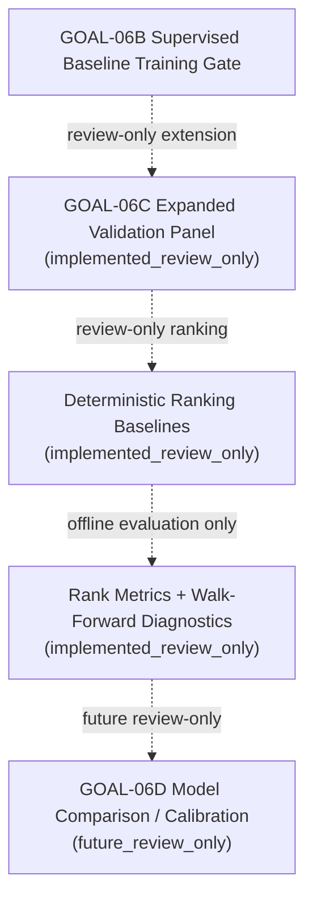

# A Share Premarket Core

Clean private active repository for the A-share pre-market alpha diagnosis and
risk-aware position-building decision support system.

This is not an automatic trading bot and does not provide investment advice. It
is a deterministic, review-only research workflow for PIT-safe data contracts,
label construction, feature-label merging, leakage checks, baseline scoring, the
GOAL-06B supervised baseline training gate, and GOAL-06C expanded validation.

## Repository Roles

- `RyanLu0203/A_share_premarket_core`: clean active source of truth.
- `RyanLu0203/A_share_market_analysis_and_prediction`: historical
  legacy/evidence reference only.

This bootstrap is selective. It is not a mirror migration and does not copy the
legacy implementation tree.

## Quickstart

Supported runtime: Python `>=3.9`. The clean GOAL-06B workflow was verified
under Python `3.9.21` during fresh-clone audit.

```bash
python -m compileall src scripts tests
python -m pytest tests -q
python scripts/run_goal06b_regression_suite.py
python scripts/run_goal06c_expanded_validation.py
python scripts/run_e2e_trunk_verification_through_goal06b.py
python scripts/run_e2e_trunk_validation_through_goal06b.py
python scripts/run_safety_gate.py
python scripts/run_adapter_audit.py
```

## Active Workflow



This active diagram uses solid arrows only and stops at GOAL-06B. GOAL-06C is
implemented as a review-only validation extension, not as active scoring,
recommendation, or position output.

## Review-Only Validation Extension



GOAL-06C ranks are audit artifacts only. They are not recommendations, buy/sell
signals, position bands, portfolio weights, or production model outputs.

## Required Public Commands

The target repo preserves the active GOAL-06B command surface and GOAL-06C
review-only validation wrappers:

- `python scripts/audit_existing_modules.py`
- `python scripts/build_pit_signal_snapshot.py`
- `python scripts/audit_pit_signal_snapshot.py`
- `python scripts/build_label_snapshot.py`
- `python scripts/audit_label_snapshot.py`
- `python scripts/build_model_ready_candidate_dataset.py`
- `python scripts/audit_feature_label_leakage.py`
- `python scripts/run_stage6a_blocker_repair.py --no-network`
- `python scripts/run_baseline_scoring_skeleton.py`
- `python scripts/audit_baseline_scoring_skeleton.py`
- `python scripts/run_supervised_baseline_training.py`
- `python scripts/audit_supervised_baseline_training.py`
- `python scripts/build_stage6c_expanded_validation_dataset.py`
- `python scripts/audit_stage6c_expanded_validation.py`
- `python scripts/run_stage6c_ranking_baselines.py`
- `python scripts/audit_stage6c_ranking_baselines.py`
- `python scripts/run_stage6c_walk_forward_validation.py`
- `python scripts/run_goal06c_expanded_validation.py`
- `python scripts/run_current_trunk_validation.py`
- `python scripts/run_program_validation_profile.py`
- `python scripts/run_safety_gate.py`
- `python scripts/run_adapter_audit.py`
- `python scripts/run_workflow_diagnostics.py`
- `python scripts/audit_workflow_status.py`

## Protected Outputs

The active evidence chain is regenerated locally and committed only as concise,
sanitized CSV/Markdown/JSON artifacts. Raw provider payloads, raw HTML, full news
text, DBs, notebooks, caches, private logs, dashboards, and model artifacts for
production promotion are forbidden.

Stable committed reports do not store volatile wall-clock timings. Runtime
details are preserved in ignored local diagnostics under `outputs/local/runtime/`.

## Lock Boundary

Recommendation, risk overlay calculation, dashboard, paper trading,
broker/live trading, production DB writes, production model promotion, and
DQN/RL remain locked. GOAL-06D is future review-only work and may proceed only
under the constraints stated in `outputs/audits/stage6c_readiness_report.md`.

## Workflow Promotion Rule

A future workflow block can only be promoted from dotted/future to
solid/implemented if:

1. The corresponding goal has a readiness report.
2. The readiness report is `PASS` or acceptable `PASS_WITH_WARNINGS`.
3. Validation and verification commands pass.
4. `configs/project/workflow_status.csv` is updated.
5. README and architecture diagrams are updated.
6. `PROJECT_STATE.md` is updated.
7. Locked downstream modules remain locked unless explicitly unlocked by that
   goal.

Do not silently change the workflow diagram to make future stages look
implemented. Do not add new downstream blocks without updating
`workflow_status.csv`. Do not remove locks from risk, recommendation,
dashboard, paper/live trading, production, or DQN/RL unless a later explicit
gate allows it.
