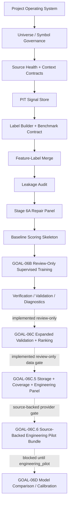

# Program Roadmap And Architecture

This document summarizes the clean active workflow after the private bootstrap.

See also:

- `docs/architecture/CANONICAL_WORKFLOW_STATUS.md`
- `docs/architecture/ACTIVE_WORKFLOW_THROUGH_GOAL06B.md`
- `docs/architecture/FULL_PROGRAM_ROADMAP_AFTER_CLEAN_BOOTSTRAP.md`

Locked future modules are documented in the roadmap and are not imported by the
active trunk.

The canonical status contract is `configs/project/workflow_status.csv`.
Implemented active blocks use solid arrows. GOAL-06C and GOAL-06C.5 are
implemented as review-only dotted extensions; GOAL-06C.6 is also
implemented_review_only and network-disabled by default. Future, design-only,
locked, and deleted-from-active-mainline blocks use dotted arrows or side-note
references.
