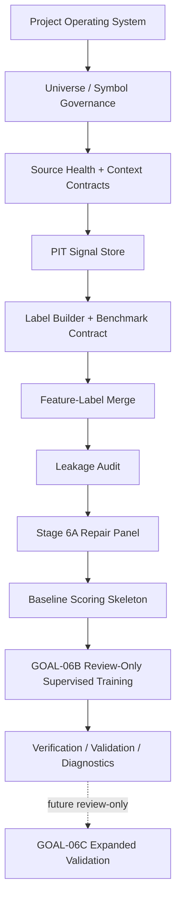

# Program Roadmap And Architecture

This document summarizes the clean active workflow after the private bootstrap.

See also:

- `docs/architecture/ACTIVE_WORKFLOW_THROUGH_GOAL06B.md`
- `docs/architecture/FULL_PROGRAM_ROADMAP_AFTER_CLEAN_BOOTSTRAP.md`

Locked future modules are documented in the roadmap and are not imported by the
active trunk.
