# Program Roadmap And Architecture

This document summarizes the clean active workflow after the private bootstrap.

See also:

- `docs/architecture/CANONICAL_WORKFLOW_STATUS.md`
- `docs/architecture/ACTIVE_WORKFLOW_THROUGH_GOAL06B.md`
- `docs/architecture/FULL_PROGRAM_ROADMAP_AFTER_CLEAN_BOOTSTRAP.md`

```mermaid
flowchart TD
    A["Project Operating System"] --> B["Universe / Symbol Governance"]
    B --> C["Source Health + Context Contracts"]
    C --> D["PIT Signal Store"]
    D --> E["Label Builder + Benchmark Contract"]
    E --> F["Feature-Label Merge"]
    F --> G["Leakage Audit"]
    G --> H["Stage 6A Repair Panel"]
    H --> I["Baseline Scoring Skeleton"]
    I --> J["GOAL-06B Review-Only Supervised Training"]
    J --> K["Verification / Validation / Diagnostics"]
    K -. "implemented review-only" .-> L["GOAL-06C Expanded Validation + Ranking"]
    L -. "implemented review-only data gate" .-> N["GOAL-06C.5 Storage + Coverage + Engineering Panel"]
    N -. "source-backed provider gate" .-> O["GOAL-06C.6 Source-Backed Engineering Pilot Bundle"]
    O -. "failure taxonomy gate" .-> P["GOAL-06C.6A Scoped Network + Failure Taxonomy"]
    P -. "provider ladder gate" .-> Q["GOAL-06C.7 Provider Ladder Engineering Data Base Expansion"]
    Q -. "implemented review-only after engineering_pilot" .-> M["GOAL-06D Model Comparison / Calibration / Stability"]
    M -. "warning repair review-only" .-> M2["GOAL-06D.1 Calibration / Stability Warning Repair"]
    M2 -. "implemented design-only" .-> R["GOAL-07A Risk Overlay Design<br/>(implemented_design_only; PASS_WITH_WARNINGS)"]
    R -. "review-only unlock readiness" .-> R2["GOAL-07A.1 Design Review<br/>(implemented_review_only; PASS_WITH_WARNINGS)"]
    R2 -. "explicit unlock gate" .-> R3["GOAL-07B.0 Unlock Gate<br/>(implemented_review_only; PASS_WITH_WARNINGS)"]
    R3 -. "review-only diagnostics" .-> R4["GOAL-07B Risk Overlay Calculation<br/>(implemented_review_only; PASS_WITH_WARNINGS)"]
    R4 -. "implemented design-only" .-> R5["GOAL-08A Recommendation Contract Design<br/>(implemented_design_only; PASS)"]
    R5 -. "implemented infrastructure-only" .-> R7["GOAL-STORAGE-01 Local Research Lake Hardening<br/>(implemented_infrastructure_only; PASS)"]
    R7 -. "explicit review-only unlock gate" .-> R8["GOAL-08B.0 Unlock Gate<br/>(implemented_review_only; PASS_WITH_WARNINGS)"]
    R8 -. "review-only diagnostics" .-> R6["GOAL-08B Recommendation Diagnostics<br/>(implemented_review_only; PASS_WITH_WARNINGS)"]
    R6 -. "explicit review-only unlock gate" .-> R9A["GOAL-09.0 Position-Band Unlock Gate<br/>(implemented_review_only; PASS_WITH_WARNINGS)"]
    R9A -. "review-only diagnostics" .-> R9["GOAL-09 Position-Band Diagnostics<br/>(implemented_review_only; PASS_WITH_WARNINGS)"]
    R9 -. "warning review / dashboard readiness" .-> R91["GOAL-09.1 Dashboard Readiness<br/>(implemented_review_only; PASS_WITH_WARNINGS)"]
    R91 -. "GOAL-DASHBOARD-00 may be requested; UI locked" .-> D1["Dashboard / Daily Report UI<br/>(locked_future)"]
    M2 -. "planned locked" .-> V2["V2 Factor Research<br/>(planned_locked; inactive in V1)"]
```

Locked future modules are documented in the roadmap and are not imported by the
active trunk.

The canonical status contract is `configs/project/workflow_status.csv`.
Implemented active blocks use solid arrows. GOAL-06C and GOAL-06C.5 are
implemented as review-only dotted extensions; GOAL-06C.6 is also
implemented_review_only and network-disabled by default. GOAL-06C.6A is
implemented_review_only and classifies provider/network failures by specific
failure type, with a separate opt-in CloakBrowser reference probe for sanitized
tag-only access diagnostics. GOAL-06C.7 is implemented_review_only for a
provider ladder whose browser-assisted provider is explicit opt-in only and
counts only schema-valid finance rows. The latest GOAL-06C.7 readiness report
is `PASS` at `engineering_pilot`. GOAL-06D is implemented_review_only and
currently `PASS_WITH_WARNINGS`; it selected `score_based_alpha_ranking` as a
weak review-only baseline and requires calibration/stability warning fixes
before any GOAL-07A design-only preparation. GOAL-06D.1 is implemented
review-only and bounds those warnings with repaired score variants,
target-horizon diagnostics, calibration reliability checks, feature sign
stability diagnostics, and provider concentration disclosure. GOAL-07A is
implemented only as design governance with warnings and no risk overlay
calculation. GOAL-07A.1 is implemented only as review-only design review and
GOAL-07B.0 is implemented only as a review-only unlock gate. GOAL-07B is
implemented only as a review-only, non-actionable risk diagnostic prototype.
GOAL-08A is implemented only as a design-only names-only contract gate with zero
recommendation rows. GOAL-STORAGE-01 is implemented only as infrastructure
hardening for local research lake governance and does not unlock GOAL-08B by
itself. GOAL-08B.0 is implemented only as a review-only unlock gate. GOAL-08B
is implemented only as non-actionable review-only diagnostics with 100
`trade_date + symbol` rows and no actionable recommendation or execution
outputs. GOAL-09.0 is implemented only as a review-only unlock gate. GOAL-09
is implemented only as non-actionable review-only position-band diagnostics and
does not create actual positions, sizing, weights, orders, or execution output.
GOAL-09.1 is implemented only as warning-review and dashboard-readiness
evidence. It allows a future explicit GOAL-DASHBOARD-00 design/contract gate
request, but it does not implement dashboard files, visual reports, frontend, or
any UI output. Dashboard / Daily Report UI and downstream execution stages
remain locked future work. V2 factor
research is planned but inactive; no V2 factor mining, IC/RankIC mining, factor
library generation, or factor integration is active in V1. Future,
design-only, infrastructure-only, locked, planned-locked, and
deleted-from-active-mainline blocks use dotted arrows or side-note references.
