# Program Roadmap And Architecture

This document summarizes the clean active workflow after the private bootstrap.

See also:

- `docs/architecture/CANONICAL_WORKFLOW_STATUS.md`
- `docs/architecture/ACTIVE_WORKFLOW_THROUGH_GOAL06B.md`
- `docs/architecture/FULL_PROGRAM_ROADMAP_AFTER_CLEAN_BOOTSTRAP.md`

```mermaid
flowchart TD
    A["Project Operating System"] --> B["Universe / Symbol Governance"]
    B --> C["Source Health + Context Contracts"]
    C --> D["PIT Signal Store"]
    D --> E["Label Builder + Benchmark Contract"]
    E --> F["Feature-Label Merge"]
    F --> G["Leakage Audit"]
    G --> H["Stage 6A Repair Panel"]
    H --> I["Baseline Scoring Skeleton"]
    I --> J["GOAL-06B Review-Only Supervised Training"]
    J --> K["Verification / Validation / Diagnostics"]
    K -. "implemented review-only" .-> L["GOAL-06C Expanded Validation + Ranking"]
    L -. "implemented review-only data gate" .-> N["GOAL-06C.5 Storage + Coverage + Engineering Panel"]
    N -. "source-backed provider gate" .-> O["GOAL-06C.6 Source-Backed Engineering Pilot Bundle"]
    O -. "failure taxonomy gate" .-> P["GOAL-06C.6A Scoped Network + Failure Taxonomy"]
    P -. "provider ladder gate" .-> Q["GOAL-06C.7 Provider Ladder Engineering Data Base Expansion"]
    Q -. "implemented review-only after engineering_pilot" .-> M["GOAL-06D Model Comparison / Calibration / Stability"]
    M -. "warning repair review-only" .-> M2["GOAL-06D.1 Calibration / Stability Warning Repair"]
    M2 -. "implemented design-only" .-> R["GOAL-07A Risk Overlay Design<br/>(implemented_design_only; PASS_WITH_WARNINGS)"]
    R -. "review-only unlock readiness" .-> R2["GOAL-07A.1 Design Review<br/>(implemented_review_only; PASS_WITH_WARNINGS)"]
    R2 -. "explicit unlock gate" .-> R3["GOAL-07B.0 Unlock Gate<br/>(implemented_review_only; PASS_WITH_WARNINGS)"]
    R3 -. "review-only diagnostics" .-> R4["GOAL-07B Risk Overlay Calculation<br/>(implemented_review_only; PASS_WITH_WARNINGS)"]
    R4 -. "implemented design-only" .-> R5["GOAL-08A Recommendation Contract Design<br/>(implemented_design_only; PASS)"]
    R5 -. "implemented infrastructure-only" .-> R7["GOAL-STORAGE-01 Local Research Lake Hardening<br/>(implemented_infrastructure_only; PASS)"]
    R7 -. "explicit review-only unlock gate" .-> R8["GOAL-08B.0 Unlock Gate<br/>(implemented_review_only; PASS_WITH_WARNINGS)"]
    R8 -. "review-only diagnostics" .-> R6["GOAL-08B Recommendation Diagnostics<br/>(implemented_review_only; PASS_WITH_WARNINGS)"]
    R6 -. "explicit review-only unlock gate" .-> R9A["GOAL-09.0 Position-Band Unlock Gate<br/>(implemented_review_only; PASS_WITH_WARNINGS)"]
    R9A -. "review-only diagnostics" .-> R9["GOAL-09 Position-Band Diagnostics<br/>(implemented_review_only; PASS_WITH_WARNINGS)"]
    R9 -. "warning review / dashboard readiness" .-> R91["GOAL-09.1 Dashboard Readiness<br/>(implemented_review_only; PASS_WITH_WARNINGS)"]
    R91 -. "artifact-lineage integrity only" .-> V1["GOAL-V1-INTEGRITY-01 Structure Gate<br/>(implemented_infrastructure_only; PASS_WITH_WARNINGS)"]
    V1 -. "implemented design-only" .-> T10A["GOAL-10A Backtest Contract Design<br/>(implemented_design_only; PASS_WITH_WARNINGS)"]
    T10A -. "review-only diagnostics" .-> T10B["GOAL-10B Recommendation Diagnostics Backtest<br/>(implemented_review_only; PASS_WITH_WARNINGS)"]
    T10B -. "coverage repair diagnostics" .-> T10B1["GOAL-10B.1 Coverage Repair Gate<br/>(implemented_review_only; PASS_WITH_WARNINGS)"]
    T10B1 -. "label coverage expansion" .-> DL01["GOAL-DATA-LABEL-01 Forward-Return Label Coverage<br/>(implemented_review_only; PASS_WITH_WARNINGS)"]
    DL01 -. "review-only diagnostics" .-> DC02["GOAL-V1-DIAGNOSTIC-COVERAGE-02 Multi-Symbol Diagnostics<br/>(implemented_review_only; PASS_WITH_WARNINGS)"]
    DC02 -. "review-only revalidation" .-> T10B2["GOAL-10B.2 Recommendation Backtest Revalidation<br/>(implemented_review_only; PASS_WITH_WARNINGS)"]
    T10B2 -. "review-only sensitivity" .-> T10C["GOAL-10C Cost / Slippage Sensitivity<br/>(implemented_review_only; PASS_WITH_WARNINGS)"]
    T10C -. "provider capability probe" .-> P02A["GOAL-DATA-PROVIDER-02A Multi-Provider Capability Probe<br/>(implemented_review_only; PASS_WITH_WARNINGS)"]
    P02A -. "network opt-in smoke test" .-> P02A1["GOAL-DATA-PROVIDER-02A.1 Network Opt-In Provider Smoke Test<br/>(implemented_review_only; PASS_WITH_WARNINGS)"]
    P02A1 -. "source-backed panel gate" .-> P02B["GOAL-DATA-PROVIDER-02B Source-Backed Panel Build<br/>(implemented_review_only; PASS_WITH_WARNINGS)"]
    P02B -. "evaluation panel remains locked" .-> PANEL02["GOAL-DATA-PANEL-02 Evaluation Panel<br/>(locked_future)"]
    P02B -. "source-backed diagnostics" .-> DC03["GOAL-V1-DIAGNOSTIC-COVERAGE-03 Source-Backed Diagnostics<br/>(implemented_review_only; PASS_WITH_WARNINGS)"]
    DC03 -. "locked future" .-> T10B3["GOAL-10B.3 Recommendation Backtest Revalidation<br/>(locked_future)"]
    T10C -. "locked future" .-> T10D["GOAL-10D Failure Attribution<br/>(locked_future)"]
    V1 -. "dashboard UI locked" .-> D1["Dashboard / Daily Report UI<br/>(locked_future)"]
    M2 -. "planned locked" .-> V2["V2 Factor Research<br/>(planned_locked; inactive in V1)"]
```

Locked future modules are documented in the roadmap and are not imported by the
active trunk.

The canonical status contract is `configs/project/workflow_status.csv`.
Implemented active blocks use solid arrows. GOAL-06C and GOAL-06C.5 are
implemented as review-only dotted extensions; GOAL-06C.6 is also
implemented_review_only and network-disabled by default. GOAL-06C.6A is
implemented_review_only and classifies provider/network failures by specific
failure type, with a separate opt-in CloakBrowser reference probe for sanitized
tag-only access diagnostics. GOAL-06C.7 is implemented_review_only for a
provider ladder whose browser-assisted provider is explicit opt-in only and
counts only schema-valid finance rows. The latest GOAL-06C.7 readiness report
is `PASS` at `engineering_pilot`. GOAL-06D is implemented_review_only and
currently `PASS_WITH_WARNINGS`; it selected `score_based_alpha_ranking` as a
weak review-only baseline and requires calibration/stability warning fixes
before any GOAL-07A design-only preparation. GOAL-06D.1 is implemented
review-only and bounds those warnings with repaired score variants,
target-horizon diagnostics, calibration reliability checks, feature sign
stability diagnostics, and provider concentration disclosure. GOAL-07A is
implemented only as design governance with warnings and no risk overlay
calculation. GOAL-07A.1 is implemented only as review-only design review and
GOAL-07B.0 is implemented only as a review-only unlock gate. GOAL-07B is
implemented only as a review-only, non-actionable risk diagnostic prototype.
GOAL-08A is implemented only as a design-only names-only contract gate with zero
recommendation rows. GOAL-STORAGE-01 is implemented only as infrastructure
hardening for local research lake governance and does not unlock GOAL-08B by
itself. GOAL-08B.0 is implemented only as a review-only unlock gate. GOAL-08B
is implemented only as non-actionable review-only diagnostics with 100
`trade_date + symbol` rows and no actionable recommendation or execution
outputs. GOAL-09.0 is implemented only as a review-only unlock gate. GOAL-09
is implemented only as non-actionable review-only position-band diagnostics and
does not create actual positions, sizing, weights, orders, or execution output.
GOAL-09.1 is implemented only as warning-review and dashboard-readiness
evidence. GOAL-V1-INTEGRITY-01 is implemented only as infrastructure
artifact-lineage/structure evidence over the canonical GOAL-07B -> GOAL-08B ->
GOAL-09 -> GOAL-09.1 chain. GOAL-10A is implemented only as design-only future
backtest contract evidence over GOAL-08B/GOAL-09 diagnostics; it defines
input, date alignment, T+1/no-lookahead, metrics, grouping, benchmark,
cost/slippage, and tradability rules but runs no backtest. GOAL-10B is
implemented only as a review-only, non-actionable recommendation diagnostics
backtest over GOAL-08B rows and existing PIT-safe forward-return labels; it
creates grouped diagnostic metrics and IC/RankIC availability evidence only.
GOAL-10B.1 is implemented only as review-only coverage repair diagnostics; it
audits current label and recommendation coverage, records that repair is not
possible with current artifacts, and writes no repaired rows or metrics.
GOAL-DATA-LABEL-01 is implemented only as review-only label coverage evidence,
and GOAL-V1-DIAGNOSTIC-COVERAGE-02 is implemented only as non-actionable
multi-symbol diagnostic coverage evidence. GOAL-10B.2 and GOAL-10C are
implemented only as review-only non-actionable revalidation and sensitivity
diagnostics over bounded DC02 rows. GOAL-DATA-PROVIDER-02A is implemented only
as review-only provider capability metadata for future source-backed planning;
it builds no evaluation panel and creates no diagnostics or backtests.
GOAL-DATA-PROVIDER-02A.1 is implemented only as review-only network-opt-in
provider smoke-test metadata; live access is attempted only with explicit env
opt-ins, Tushare tokens are environment-only, and no raw payloads or tokens are
persisted.
GOAL-DATA-PROVIDER-02B is implemented only as bounded source-backed normalized
panel evidence plus provider/coverage audit metadata. GOAL-V1-DIAGNOSTIC-
COVERAGE-03 is implemented only as non-actionable source-backed diagnostic
coverage over that 02B panel; it does not overwrite canonical GOAL-07B/08B/09
artifacts or unlock backtests, dashboards, trading, production, local-lake,
broker, factor-mining, or DQN/RL outputs. GOAL-DATA-PANEL-02, GOAL-10B.3,
GOAL-10D, Dashboard / Daily Report UI, and downstream execution stages remain
locked future work; no dashboard files, visual reports, frontend, or UI output
exist. V2 factor
research is planned but inactive; no V2 factor mining, IC/RankIC mining, factor
library generation, or factor integration is active in V1. Future,
design-only, infrastructure-only, locked, planned-locked, and
deleted-from-active-mainline blocks use dotted arrows or side-note references.
