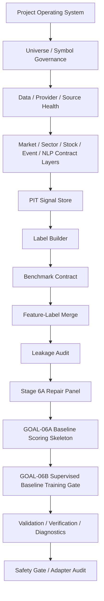
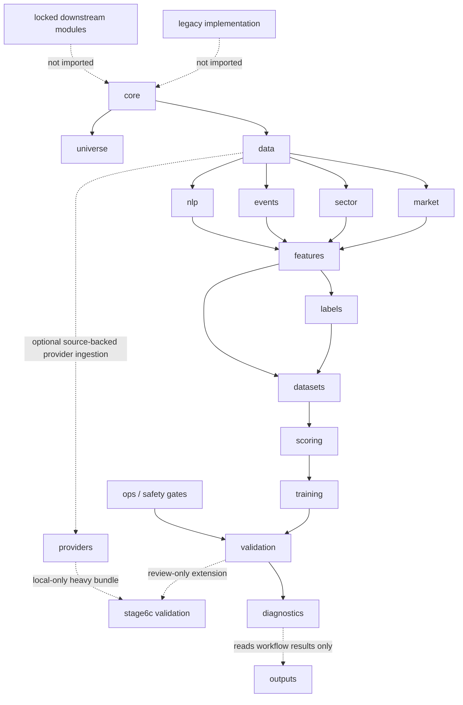

# Active Workflow Through GOAL-06B

This is the only implemented active scoring workflow. It uses solid arrows only
and does not include GOAL-06C or any downstream future block as active scoring.
GOAL-06C is implemented separately as review-only validation evidence. No
active node imports legacy demo paths, old runtime-evidence modules, obsolete
step runners, DQN/RL, dashboard, paper trading, recommendation, risk overlay,
broker/live trading, production DB writes, or production model promotion code.

## GOAL-06C Review-Only Validation Extension

```mermaid
flowchart TD
    A["GOAL-06B Supervised Baseline Training Gate"] -. "review-only validation extension" .-> B["Expanded Validation Panel<br/>(implemented_review_only)"]
    B -. "deterministic offline ranks" .-> C["Ranking Baselines<br/>(implemented_review_only)"]
    C -. "offline evaluation only" .-> D["Rank Metrics + Walk-Forward Diagnostics<br/>(implemented_review_only)"]
    D -. "engineering data gate" .-> E["GOAL-06C.5 Storage + Coverage + Panel Gate<br/>(implemented_review_only)"]
    E -. "source-backed provider gate" .-> F["GOAL-06C.6 Source-Backed Bundle Gate<br/>(implemented_review_only)"]
    F -. "failure taxonomy gate" .-> G["GOAL-06C.6A Scoped Network + Failure Taxonomy<br/>(implemented_review_only)"]
    G -. "provider ladder gate" .-> H["GOAL-06C.7 Provider Ladder Engineering Data Base Expansion<br/>(implemented_review_only; engineering_pilot)"]
    H -. "implemented review-only after engineering_pilot" .-> I["GOAL-06D Model Comparison / Calibration / Stability<br/>(implemented_review_only; PASS_WITH_WARNINGS)"]
    I -. "warning repair review-only" .-> I2["GOAL-06D.1 Calibration / Stability Warning Repair<br/>(implemented_review_only; PASS_WITH_WARNINGS)"]
    I2 -. "implemented design-only" .-> J["GOAL-07A Risk Overlay Design<br/>(implemented_design_only; PASS_WITH_WARNINGS)"]
    J -. "review-only design review" .-> J2["GOAL-07A.1 Design Review<br/>(implemented_review_only; PASS_WITH_WARNINGS)"]
    J2 -. "explicit unlock gate" .-> J3["GOAL-07B.0 Unlock Gate<br/>(implemented_review_only; PASS_WITH_WARNINGS)"]
    J3 -. "review-only diagnostics" .-> K["GOAL-07B Risk Overlay Calculation<br/>(implemented_review_only; PASS_WITH_WARNINGS)"]
    K -. "implemented design-only" .-> L["GOAL-08A Recommendation Contract Design<br/>(implemented_design_only; PASS)"]
    L -. "implemented infrastructure-only" .-> S01["GOAL-STORAGE-01 Local Research Lake Hardening<br/>(implemented_infrastructure_only; PASS)"]
    S01 -. "explicit review-only unlock gate" .-> S02["GOAL-08B.0 Unlock Gate<br/>(implemented_review_only; PASS_WITH_WARNINGS)"]
    S02 -. "review-only diagnostics" .-> M["GOAL-08B Recommendation Diagnostics<br/>(implemented_review_only; PASS_WITH_WARNINGS)"]
    M -. "explicit review-only unlock gate" .-> N0["GOAL-09.0 Position-Band Unlock Gate<br/>(implemented_review_only; PASS_WITH_WARNINGS)"]
    N0 -. "review-only diagnostics" .-> N["GOAL-09 Position-Band Diagnostics<br/>(implemented_review_only; PASS_WITH_WARNINGS)"]
    N -. "warning review / dashboard readiness" .-> N1["GOAL-09.1 Dashboard Readiness<br/>(implemented_review_only; PASS_WITH_WARNINGS)"]
```

The extension writes review-only evidence under `outputs/stage6c/`,
`outputs/audits/`, and, for GOAL-07B only, non-actionable diagnostics under
`outputs/risk_overlay/`. It does not emit recommendations, position bands,
portfolio weights, dashboard outputs, trading instructions, production writes,
production model promotion, or DQN/RL artifacts. GOAL-06C.6 provider
ingestion is network-disabled by default on the direct AKShare path. The
explicit CloakBrowser reference probe is separate tag-only evidence and does not
change the active workflow through GOAL-06B. GOAL-06D and GOAL-06D.1 are
review-only and currently `PASS_WITH_WARNINGS`; GOAL-07A is design-only,
GOAL-07B.0 is unlock-only, and GOAL-07B is implemented only as a review-only
diagnostic prototype. GOAL-08A is implemented only as a names-only design gate
with zero recommendation rows. GOAL-STORAGE-01 is implemented only as
infrastructure hardening for local storage governance and does not unlock
GOAL-08B by itself. GOAL-08B.0 is implemented only as a review-only unlock gate
and GOAL-08B is implemented only as non-actionable review-only diagnostics.
GOAL-09.0 is implemented only as a review-only unlock gate. GOAL-09 is
implemented only as non-actionable review-only position-band diagnostics, and
GOAL-09.1 is implemented only as warning-review and dashboard-readiness
evidence. It creates no dashboard output and only permits a future explicit
GOAL-DASHBOARD-00 design/contract gate request; Dashboard / Daily Report UI and
downstream trading/production workflow remain locked.

## Module Dependency Structure

Diagnostics reads workflow results and helps the next worker triage failures; it
does not drive business logic.
