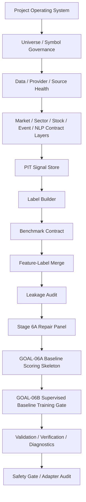
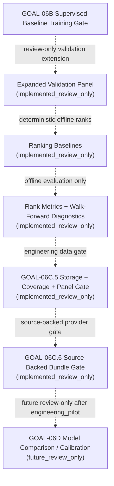
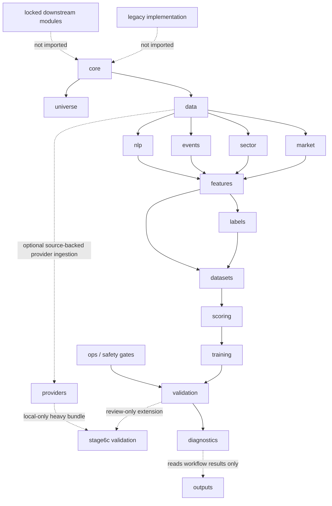

# Active Workflow Through GOAL-06B

This is the only implemented active scoring workflow. It uses solid arrows only
and does not include GOAL-06C or any downstream future block as active scoring.
GOAL-06C is implemented separately as review-only validation evidence. No
active node imports legacy demo paths, old runtime-evidence modules, obsolete
step runners, DQN/RL, dashboard, paper trading, recommendation, risk overlay,
broker/live trading, production DB writes, or production model promotion code.

## GOAL-06C Review-Only Validation Extension

The extension writes review-only evidence under `outputs/stage6c/` and
`outputs/audits/`. It does not emit recommendations, position bands, portfolio
weights, risk overlays, dashboard outputs, trading instructions, production
writes, production model promotion, or DQN/RL artifacts. GOAL-06C.6 provider
ingestion is network-disabled by default on the direct AKShare path. The
explicit CloakBrowser reference probe is separate tag-only evidence and does not
change the active workflow through GOAL-06B.

## Module Dependency Structure

Diagnostics reads workflow results and helps the next worker triage failures; it
does not drive business logic.
