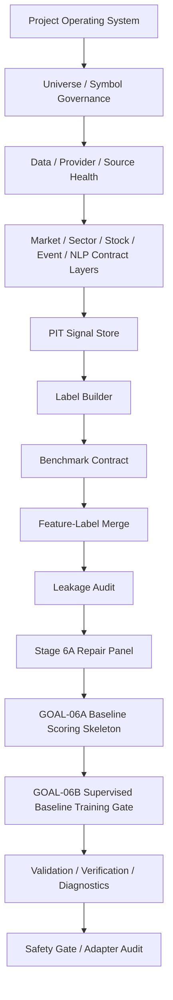
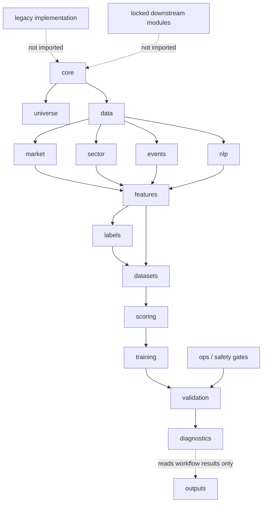

# Active Workflow Through GOAL-06B

This is the only implemented active workflow. It uses solid arrows only and
does not include GOAL-06C or any downstream future block as active. No active
node imports legacy demo paths, old runtime-evidence modules, obsolete step
runners, DQN/RL, dashboard, paper trading, recommendation, risk overlay,
broker/live trading, production DB writes, or production model promotion code.

## Module Dependency Structure

Diagnostics reads workflow results and helps the next worker triage failures; it
does not drive business logic.
