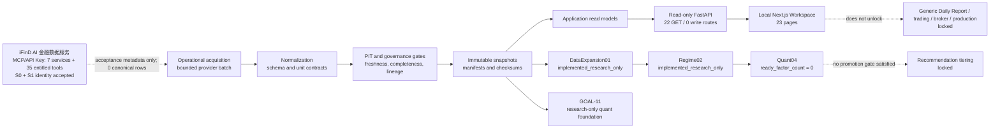

# Current System Architecture

**As of:** 2026-08-09
**Authoritative branch:** `project-current`
**Scope:** current implemented architecture and locked boundaries, not a future-state roadmap

This document is the compact architecture truth for the current A-share
premarket system. The durable repository source of truth is the reviewed
`project-current` branch. A local worktree, an older `main` branch, or a legacy
diagram is not deployment truth by itself.

## 1. System boundary

The implemented system is a local, read-only research and position-management
workspace over governed evidence. Its operational data path is:

1. bounded provider acquisition;
2. schema normalization and source-specific unit handling;
3. point-in-time (PIT), completeness, freshness, and lineage validation;
4. checksummed immutable snapshots and manifests;
5. application read models;
6. a loopback FastAPI service with exactly 22 GET routes and no write routes;
7. a 23-page Next.js Workspace.

The API and Workspace read accepted evidence. They do not fetch providers,
promote factors, create recommendations, place orders, or write production
state.

## 2. Implemented layers

| Layer | Current state | Contract |
|---|---|---|
| Acquisition | Implemented, provider-gated | Network access is disabled by default. A live run requires explicit provider opt-in and must fail closed on partial coverage or schema drift. Tencent via AKShare is the documented operational primary for the last accepted 41-symbol runs. |
| Normalization and PIT | Implemented | Provider fields and units are normalized before use. Trade-date, freshness, no-lookahead, completeness, provenance, and checksum checks precede snapshot promotion. Missing values are preserved as unavailable; they are not fabricated. |
| Evidence storage | Implemented | Accepted data is exposed through immutable, checksummed snapshots and bounded manifests. Raw or paid full-provider payloads, credentials, databases, caches, and private logs are not GitHub artifacts. |
| Application/API | Implemented, read-only | The canonical interface registry declares 22 GET routes. The FastAPI application permits GET-only loopback access and has no write routes. Provider acquisition is not invoked by API reads. |
| Local Workspace | Implemented, research-only | The Next.js Workspace has 23 registered pages. Effective governance state is 16 available, 1 hybrid, and 6 locked. The named Workspace is not the generic Dashboard / Daily Report workflow. |
| Quant research | Implemented, research-only | `DataExpansion01 -> Regime02 -> Quant04` is complete as a research lineage. `ready_factor_count` remains `0`; no recommendation-tiering promotion is permitted. |
| GOAL-11 | Implemented, research-only | Provides deterministic PIT features, interpretable alpha construction, a fixed-ridge baseline, chronological evaluation, and risk adjustment. Runtime research evidence remains local/ignored and does not alter production locks. |
| iFinD AI 金融数据服务 | S0 and S1 identity accepted; S2 live response schema blocked | The MCP/API Key channel passes seven services and 35/35 tools/schemas. Both fixed summaries passed scope, identity and schema. One authorized S2 run stopped on the first Luxshare `get_stock_info` response mismatch: 1/4 calls, zero retry, zero normalized/canonical rows. Further calls require offline diagnosis and new authorization; S3-S4/research remain locked. |

Canonical interface details are maintained in
[`configs/project/canonical_interfaces.json`](../../configs/project/canonical_interfaces.json)
and
[`CANONICAL_PROGRAM_INTERFACES.md`](CANONICAL_PROGRAM_INTERFACES.md).

## 3. Data scopes: do not conflate these populations

| Scope | Symbols | Dates | Rows | Meaning |
|---|---:|---:|---:|---|
| Canonical approved-symbol governance scope | 2 | varies by gate | varies | `002475.SZ` and `600036.SH`; a narrow governance/contract scope, not the whole research or operational universe. |
| iFinD dual-stock browsing / acceptance cohort | 2 | 120 existing dates for `002475.SZ`; none accepted for `600487.SH` | 2 non-canonical identity staging rows | `002475.SZ` and `600487.SH`; distinct from the canonical approved pair and both outside the 41-symbol reference portfolio. Both identities passed bounded iFinD scope/schema staging; Hengtong still has no accepted market or fundamental evidence. |
| Provider02B source-backed engineering panel | 50 | 120 | 6,000 | Committed `engineering_pilot` research panel spanning 2025-11-19 through 2026-05-21. |
| Expanded network evidence / portfolio-risk canonical history | 41 with independent evidence | 843 | 34,543 | Historical evidence used by later readiness and portfolio-risk diagnostics. The broader catalog still contains 50 symbols, but only 41 have this independent evidence. |
| Last documented complete operational acquisitions | 41/41 accepted per run | 1 target date per run | 41 per run | Two complete Tencent acquisitions for dynamic target 2026-07-31 and T-1 2026-07-30. This is the last documented acceptance, not a claim of freshness for 2026-08-09. |
| iFinD live data | S0 accepted plus S1 identity acceptance metadata | no accepted dates | 0 canonical; 2 identity metadata rows | Seven services and 35 entitled schemas are accepted. Both fixed summaries passed identity/scope/schema; provider availability remains unknown and the local observation timestamp is not canonical evidence. |

The authoritative evidence for these counts lives in goal manifests, including
[`goal_data_provider02b_source_backed_panel_manifest.json`](../../outputs/audits/goal_data_provider02b_source_backed_panel_manifest.json),
[`goal_network_evidence_ingestion01_manifest.json`](../../outputs/audits/goal_network_evidence_ingestion01_manifest.json),
[`goal_premarket_portfolio_risk_management01_manifest.json`](../../outputs/audits/goal_premarket_portfolio_risk_management01_manifest.json),
and the current operational acceptance record in
[`PROJECT_STATE.md`](../../PROJECT_STATE.md).

## 4. Research lineage and promotion boundary

The current regime-conditional research lineage is implemented:

`GOAL-DATA-EXPANSION-RESEARCH-01`
-> `GOAL-REGIME-LABEL-RESEARCH-02`
-> `GOAL-QUANT-RESEARCH-04`.

All three stages are `implemented_research_only`. Quant04 uses forward returns
only post hoc for evaluation and reports `ready_factor_count = 0`. Therefore:

- `GOAL-REC-TIERING-01` remains locked;
- no factor is promoted into recommendation or execution logic;
- no recommendation, target price, actionable position, portfolio action,
  order, or predictive-validity production claim is created;
- GOAL-11 remains a separate research foundation, not a downstream unlock.

Machine workflow state is maintained in
[`configs/project/workflow_status.csv`](../../configs/project/workflow_status.csv),
and capability locks are maintained in
[`configs/project/locked_capabilities.json`](../../configs/project/locked_capabilities.json).

## 5. Workspace versus generic dashboard

The goal-specific **A-Share Premarket Workspace** is implemented as a local,
read-only research interface. This does not mean the generic Dashboard / Daily
Report capability is unlocked.

- Workspace: implemented research-only; 23 pages; 22 GET routes; no writes.
- Quant pages: bounded evidence views only; recommendation tiering remains
  locked, and unavailable metrics must render as unavailable rather than be
  synthesized.
- Generic Dashboard / Daily Report: locked.
- Recommendation generation, trading, broker connectivity, paper trading,
  production database writes, and production model promotion: locked.

The current page contract is defined by
[`apps/premarket-workspace/src/lib/navigation.ts`](../../apps/premarket-workspace/src/lib/navigation.ts),
and the API composition root is
[`src/ashare_premarket/interfaces/api/app.py`](../../src/ashare_premarket/interfaces/api/app.py).

## 6. iFinD integration boundary

The iFinD AI 金融数据服务 integration is at **purchased MCP/API Key client and
contract readiness**, not live-data acceptance. The intended boundary is:

1. rotate any credential that has appeared outside the approved secret store;
2. replace the macOS Keychain Internet Password; use an environment API Key
   only on runtimes without Keychain;
3. explicitly opt in to global network ingestion, iFinD, and the MCP channel;
4. perform `initialize` and `tools/list` against one of seven exact
   `api-mcp.51ifind.com:8643` paths without executing a data tool;
5. record which services, tools, markets, fields, history depth, quotas, and update
   frequencies are actually entitled;
6. run a separate one-tool bounded smoke test and accept only structured JSON;
7. validate returned schemas, field semantics, units, adjustment conventions,
   trade dates, PIT timestamps, pagination, and error taxonomy;
8. normalize into the existing evidence contract and produce bounded coverage,
   lineage, and checksum manifests before the provider can participate in any
   accepted data path.

Until all of these checks pass, iFinD must not be described as live, complete,
canonical, or a fallback source. API Keys and raw paid payloads must never be
printed, persisted in manifests, or committed. The integration contract is
[`configs/providers/ifind_ai_financial_data_service_contract.yaml`](../../configs/providers/ifind_ai_financial_data_service_contract.yaml).

## 7. Locked capabilities

The following remain locked regardless of UI visibility or provider-adapter
availability:

- generic Dashboard / Daily Report;
- recommendation score tiering and actionable recommendations;
- actionable positions, position validation, portfolio backtests, and
  execution outputs;
- paper/live trading, broker integration, and order placement;
- production database writes and production model promotion;
- factor mining and DQN/RL.

A capability changes state only after explicit user approval and the required
readiness evidence, validation, workflow-status update, lock update, and
documentation reconciliation. An adapter, page, endpoint, or research report
does not silently unlock a downstream capability.

## 8. Documentation truth priority

When documents disagree, use this order:

1. **Reviewed GitHub state on `project-current`** is the durable project truth.
   Local uncommitted files and stale branches are not deployment truth.
2. **Machine-readable workflow and lock state:**
   [`workflow_status.csv`](../../configs/project/workflow_status.csv),
   [`locked_capabilities.json`](../../configs/project/locked_capabilities.json),
   and
   [`canonical_interfaces.json`](../../configs/project/canonical_interfaces.json).
3. **Validated implementation and evidence:** current source contracts plus
   committed manifests, checksums, readiness reports, and independent audits.
4. **This document:** the current human-readable architecture summary.
5. **Narrative and historical material:** `PROJECT_STATE.md`, goal documents,
   `README.md`, `ROADMAP.md`, iteration logs, and older architecture diagrams.
   They provide context but must not override newer machine state or evidence.

Explicit user decisions remain the authority for goal selection and unlocks.
No document may infer an unlock merely from adjacent implementation progress.
