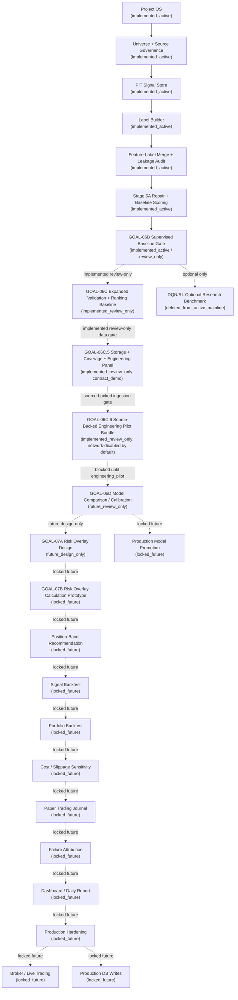

# Full Program Roadmap After Clean Bootstrap

Solid arrows are implemented active workflow through GOAL-06B. Dotted arrows are
review-only extensions, future, locked, design-only, or not-started stages.

The clean active scoring mainline is GOAL-06B and earlier. GOAL-06C and
GOAL-06C.5 and GOAL-06C.6 are implemented review-only extensions and not
recommendation, positioning, risk, trading, dashboard, production, or DQN/RL
workflows. GOAL-06C.6 uses compliant provider ingestion only when explicitly
network-enabled and does not use cloakbrowser, stealth browser automation,
captcha solving, or proxy rotation. Anything beyond GOAL-06C.6 must earn a
separate promotion gate and update
`configs/project/workflow_status.csv`.
