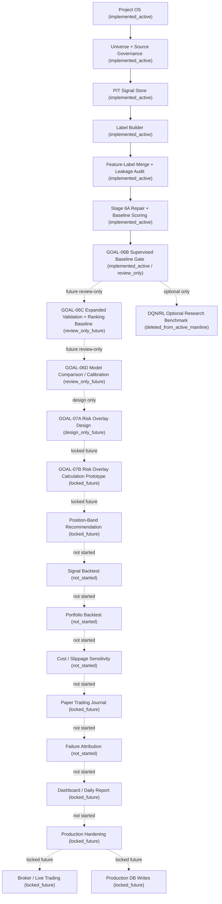

# Full Program Roadmap After Clean Bootstrap

Solid arrows are implemented active workflow through GOAL-06B. Dotted arrows are
future, locked, design-only, or not-started stages.

The clean active mainline is GOAL-06B and earlier. Anything beyond GOAL-06B must
earn a separate promotion gate.
