# Full Program Roadmap After Clean Bootstrap

Solid arrows are implemented active workflow through GOAL-06B. Dotted arrows are
review-only extensions, future, locked, design-only, or not-started stages.

```mermaid
flowchart TD
    A["Project OS<br/>(implemented_active)"] --> B["Universe + Source Governance<br/>(implemented_active)"]
    B --> C["PIT Signal Store<br/>(implemented_active)"]
    C --> D["Label Builder<br/>(implemented_active)"]
    D --> E["Feature-Label Merge + Leakage Audit<br/>(implemented_active)"]
    E --> F["Stage 6A Repair + Baseline Scoring<br/>(implemented_active)"]
    F --> G["GOAL-06B Supervised Baseline Gate<br/>(implemented_active / review_only)"]
    G -. "implemented review-only" .-> H["GOAL-06C Expanded Validation + Ranking Baseline<br/>(implemented_review_only)"]
    H -. "implemented review-only data gate" .-> X["GOAL-06C.5 Storage + Coverage + Engineering Panel<br/>(implemented_review_only; contract_demo)"]
    X -. "source-backed ingestion gate" .-> Y["GOAL-06C.6 Source-Backed Engineering Pilot Bundle<br/>(implemented_review_only; network-disabled by default)"]
    Y -. "scoped failure taxonomy" .-> Z["GOAL-06C.6A Network Isolation + Failure Taxonomy<br/>(implemented_review_only; PASS_WITH_WARNINGS)"]
    Z -. "provider ladder gate" .-> AA["GOAL-06C.7 Provider Ladder Engineering Data Base Expansion<br/>(implemented_review_only; engineering_pilot PASS)"]
    AA -. "implemented review-only after engineering_pilot" .-> I["GOAL-06D Model Comparison / Calibration / Stability<br/>(implemented_review_only; PASS_WITH_WARNINGS)"]
    I -. "warning repair review-only" .-> I2["GOAL-06D.1 Calibration / Stability Warning Repair<br/>(implemented_review_only; PASS_WITH_WARNINGS)"]
    I2 -. "implemented design-only" .-> J["GOAL-07A Risk Overlay Design<br/>(implemented_design_only; PASS_WITH_WARNINGS)"]
    J -. "review-only unlock readiness" .-> J2["GOAL-07A.1 Design Review + Unlock Readiness<br/>(implemented_review_only; PASS_WITH_WARNINGS)"]
    J2 -. "explicit review-only unlock gate" .-> J3["GOAL-07B.0 Unlock Gate<br/>(implemented_review_only; PASS_WITH_WARNINGS)"]
    J3 -. "review-only diagnostics" .-> K["GOAL-07B Risk Overlay Calculation Prototype<br/>(implemented_review_only; PASS_WITH_WARNINGS)"]
    K -. "implemented design-only" .-> K2["GOAL-08A Recommendation Contract Design<br/>(implemented_design_only; PASS)"]
    K2 -. "implemented infrastructure-only" .-> S01["GOAL-STORAGE-01 Local Research Lake Hardening<br/>(implemented_infrastructure_only; PASS)"]
    S01 -. "explicit review-only unlock gate" .-> S02["GOAL-08B.0 Unlock Gate<br/>(implemented_review_only; PASS_WITH_WARNINGS)"]
    S02 -. "review-only diagnostics" .-> K3["GOAL-08B Recommendation Diagnostics<br/>(implemented_review_only; PASS_WITH_WARNINGS)"]
    K3 -. "explicit review-only unlock gate" .-> L0["GOAL-09.0 Position-Band Unlock Gate<br/>(implemented_review_only; PASS_WITH_WARNINGS)"]
    L0 -. "review-only diagnostics" .-> L["GOAL-09 Position-Band Diagnostics<br/>(implemented_review_only; PASS_WITH_WARNINGS)"]
    L -. "warning review / dashboard readiness" .-> L1["GOAL-09.1 Dashboard Readiness<br/>(implemented_review_only; PASS_WITH_WARNINGS)"]
    L1 -. "artifact-lineage integrity only" .-> V1["GOAL-V1-INTEGRITY-01 Structure Gate<br/>(implemented_infrastructure_only; PASS_WITH_WARNINGS)"]
    V1 -. "design-only contract" .-> T10A["GOAL-10A Backtest Contract Design<br/>(implemented_design_only; PASS_WITH_WARNINGS)"]
    T10A -. "review-only diagnostics" .-> T10B["GOAL-10B Recommendation Diagnostics Backtest<br/>(implemented_review_only; PASS_WITH_WARNINGS)"]
    T10B -. "coverage repair diagnostics" .-> T10B1["GOAL-10B.1 Coverage Repair Gate<br/>(implemented_review_only; PASS_WITH_WARNINGS)"]
    T10B1 -. "label coverage expansion" .-> DL01["GOAL-DATA-LABEL-01 Forward-Return Label Coverage<br/>(implemented_review_only; PASS_WITH_WARNINGS)"]
    DL01 -. "review-only diagnostics" .-> DC02["GOAL-V1-DIAGNOSTIC-COVERAGE-02 Multi-Symbol Diagnostics<br/>(implemented_review_only; PASS_WITH_WARNINGS)"]
    DC02 -. "review-only revalidation" .-> T10B2["GOAL-10B.2 Recommendation Backtest Revalidation<br/>(implemented_review_only; PASS_WITH_WARNINGS)"]
    T10B2 -. "review-only sensitivity" .-> T10C["GOAL-10C Cost / Slippage Sensitivity<br/>(implemented_review_only; PASS_WITH_WARNINGS)"]
    T10C -. "provider capability probe" .-> P02A["GOAL-DATA-PROVIDER-02A Multi-Provider Capability Probe<br/>(implemented_review_only; PASS_WITH_WARNINGS)"]
    P02A -. "network opt-in smoke test" .-> P02A1["GOAL-DATA-PROVIDER-02A.1 Network Opt-In Provider Smoke Test<br/>(implemented_review_only; PASS_WITH_WARNINGS)"]
    P02A1 -. "source-backed panel gate" .-> P02B["GOAL-DATA-PROVIDER-02B Source-Backed Panel Build<br/>(implemented_review_only; PASS_WITH_WARNINGS)"]
    P02B -. "locked future" .-> PANEL02["GOAL-DATA-PANEL-02 Evaluation Panel<br/>(locked_future)"]
    PANEL02 -. "locked future" .-> DC03["GOAL-V1-DIAGNOSTIC-COVERAGE-03 Multi-Provider Diagnostics<br/>(locked_future)"]
    DC03 -. "locked future" .-> T10B3["GOAL-10B.3 Recommendation Backtest Revalidation<br/>(locked_future)"]
    T10C -. "locked future" .-> T10D["GOAL-10D Failure Attribution<br/>(locked_future)"]
    L -. "locked future" .-> M["Signal Backtest<br/>(locked_future)"]
    M -. "locked future" .-> N["Portfolio Backtest<br/>(locked_future)"]
    N -. "locked future" .-> O["Cost / Slippage Sensitivity<br/>(locked_future)"]
    O -. "locked future" .-> P["Paper Trading Journal<br/>(locked_future)"]
    P -. "locked future" .-> Q["Failure Attribution<br/>(locked_future)"]
    Q -. "locked future" .-> R["Dashboard / Daily Report<br/>(locked_future)"]
    V1 -. "dashboard UI locked" .-> R
    R -. "locked future" .-> S["Production Hardening<br/>(locked_future)"]
    S -. "locked future" .-> T["Broker / Live Trading<br/>(locked_future)"]
    S -. "locked future" .-> U["Production DB Writes<br/>(locked_future)"]
    I2 -. "planned locked" .-> F2["V2 Factor Research Upgrade<br/>(planned_locked; inactive in V1)"]
    I -. "locked future" .-> W["Production Model Promotion<br/>(locked_future)"]
    G -. "optional only" .-> V["DQN/RL Optional Research Benchmark<br/>(deleted_from_active_mainline)"]
```

The clean active scoring mainline is GOAL-06B and earlier. GOAL-06C,
GOAL-06C.5, GOAL-06C.6, GOAL-06C.6A, GOAL-06C.7, GOAL-06D, and GOAL-06D.1 are implemented
review-only extensions and not recommendation, positioning, risk, trading,
dashboard, production, or DQN/RL workflows. GOAL-06C.6 uses compliant provider ingestion only when
explicitly network-enabled. GOAL-06C.6A classifies network failures by type
rather than using a generic network bucket. The default provider path remains
direct AKShare/local-import. The explicit CloakBrowser reference probe is
separate, opt-in, tag-only, sanitized, and does not promote any downstream
workflow block. GOAL-06C.7 adds a provider ladder where
`browser_assisted_optional` is disabled by default, requires explicit CLI plus
env opt-in, and counts only schema-valid finance rows. The latest GOAL-06C.7
readiness report proves `engineering_pilot`. GOAL-06D is implemented
review-only with `PASS_WITH_WARNINGS`; GOAL-06D.1 bounds the calibration,
stability, target-horizon, and provider-concentration warnings in a review-only
repair layer. GOAL-07A is implemented only as design governance with warnings
and no risk calculation. GOAL-07A.1 is implemented as review-only design review,
and GOAL-07B.0 is implemented as the explicit review-only unlock gate. GOAL-07B
is implemented only as a review-only, non-actionable risk diagnostic prototype.
GOAL-08A is implemented only as a design-only, names-only future recommendation
contract gate with zero rows. GOAL-STORAGE-01 is implemented only as an
infrastructure hardening gate for local research lake governance and GitHub
hygiene; it does not unlock GOAL-08B by itself. GOAL-08B.0 is implemented only
as a review-only unlock gate. GOAL-08B is implemented only as non-actionable
review-only diagnostics with 100 `trade_date + symbol` rows and no actionable
recommendation or execution outputs. GOAL-09.0 is implemented only as a
review-only unlock gate. GOAL-09 is implemented only as non-actionable
review-only position-band diagnostics with no actual position rows, sizing,
portfolio weights, orders, or execution outputs. GOAL-09.1 is implemented only
as warning-review and dashboard-readiness evidence. GOAL-V1-INTEGRITY-01 is
implemented only as infrastructure artifact-lineage/structure evidence over the
canonical GOAL-07B -> GOAL-08B -> GOAL-09 -> GOAL-09.1 chain. GOAL-09.1
classifies the remaining GOAL-09 warnings for future dashboard contract display;
GOAL-V1-INTEGRITY-01 allows only a future explicit GOAL-DASHBOARD-00
design/contract gate request and creates no dashboard output, HTML, Streamlit,
frontend code, visual report, new risk row, new recommendation row, or new
position row. GOAL-10A is implemented only as a design-only future backtest
contract gate; it defines contracts for future review-only validation and
creates no backtest performance rows, equity curves, portfolio returns, or
cost/slippage outputs. GOAL-10B is implemented only as a review-only,
non-actionable recommendation diagnostics backtest over GOAL-08B rows and
existing PIT-safe forward-return labels; it creates grouped diagnostic metrics
and IC/RankIC availability evidence only. GOAL-10B.1 is implemented only as a
review-only coverage and group-variation repair diagnostic gate; it audits
existing label/Stage6C artifacts, records that repair is not possible with
current artifacts, and creates no repaired rows or metrics. GOAL-DATA-LABEL-01
is implemented only as review-only label coverage evidence, and
GOAL-V1-DIAGNOSTIC-COVERAGE-02 is implemented only as non-actionable
multi-symbol diagnostic coverage evidence. GOAL-10B.2 and GOAL-10C are
implemented only as review-only non-actionable revalidation and sensitivity
diagnostics over bounded DC02 rows. GOAL-DATA-PROVIDER-02A is implemented only
as review-only provider capability metadata for future source-backed planning;
it builds no evaluation panel and creates no diagnostics or backtests.
GOAL-DATA-PROVIDER-02A.1 is implemented only as review-only network-opt-in
provider smoke-test metadata; live access is attempted only with explicit env
opt-ins, Tushare tokens are environment-only, and no raw payloads or tokens are
persisted.
GOAL-DATA-PROVIDER-02B is implemented only as bounded source-backed normalized
panel evidence plus provider/coverage audit metadata; it does not unlock
diagnostics, backtests, dashboards, trading, production, local-lake, broker,
factor-mining, or DQN/RL outputs. GOAL-DATA-PANEL-02,
GOAL-V1-DIAGNOSTIC-COVERAGE-03, GOAL-10B.3, and GOAL-10D remain locked_future.
V2 factor research is planned but
inactive in V1; no factor mining, IC/RankIC mining, factor library generation,
or factor integration is active. Recommendation execution, position, dashboard,
paper/live trading, production, portfolio backtest execution, factor-mining, and DQN/RL blocks
remain locked, planned-locked, design-only, or infrastructure-only.
