# Full Program Roadmap After Clean Bootstrap

Solid arrows are implemented active workflow through GOAL-06B. Dotted arrows are
review-only extensions, future, locked, design-only, or not-started stages.

```mermaid
flowchart TD
    A["Project OS<br/>(implemented_active)"] --> B["Universe + Source Governance<br/>(implemented_active)"]
    B --> C["PIT Signal Store<br/>(implemented_active)"]
    C --> D["Label Builder<br/>(implemented_active)"]
    D --> E["Feature-Label Merge + Leakage Audit<br/>(implemented_active)"]
    E --> F["Stage 6A Repair + Baseline Scoring<br/>(implemented_active)"]
    F --> G["GOAL-06B Supervised Baseline Gate<br/>(implemented_active / review_only)"]
    G -. "implemented review-only" .-> H["GOAL-06C Expanded Validation + Ranking Baseline<br/>(implemented_review_only)"]
    H -. "implemented review-only data gate" .-> X["GOAL-06C.5 Storage + Coverage + Engineering Panel<br/>(implemented_review_only; contract_demo)"]
    X -. "source-backed ingestion gate" .-> Y["GOAL-06C.6 Source-Backed Engineering Pilot Bundle<br/>(implemented_review_only; network-disabled by default)"]
    Y -. "scoped failure taxonomy" .-> Z["GOAL-06C.6A Network Isolation + Failure Taxonomy<br/>(implemented_review_only; PASS_WITH_WARNINGS)"]
    Z -. "provider ladder gate" .-> AA["GOAL-06C.7 Provider Ladder Engineering Data Base Expansion<br/>(implemented_review_only; engineering_pilot PASS)"]
    AA -. "implemented review-only after engineering_pilot" .-> I["GOAL-06D Model Comparison / Calibration / Stability<br/>(implemented_review_only; PASS_WITH_WARNINGS)"]
    I -. "warning repair review-only" .-> I2["GOAL-06D.1 Calibration / Stability Warning Repair<br/>(implemented_review_only; PASS_WITH_WARNINGS)"]
    I2 -. "implemented design-only" .-> J["GOAL-07A Risk Overlay Design<br/>(implemented_design_only; PASS_WITH_WARNINGS)"]
    J -. "review-only unlock readiness" .-> J2["GOAL-07A.1 Design Review + Unlock Readiness<br/>(implemented_review_only; PASS_WITH_WARNINGS)"]
    J2 -. "explicit review-only unlock gate" .-> J3["GOAL-07B.0 Unlock Gate<br/>(implemented_review_only; PASS_WITH_WARNINGS)"]
    J3 -. "eligible only; not implemented" .-> K["GOAL-07B Risk Overlay Calculation Prototype<br/>(future_review_only; not implemented)"]
    K -. "locked downstream" .-> L["Position-Band Recommendation<br/>(locked_future)"]
    L -. "locked future" .-> M["Signal Backtest<br/>(locked_future)"]
    M -. "locked future" .-> N["Portfolio Backtest<br/>(locked_future)"]
    N -. "locked future" .-> O["Cost / Slippage Sensitivity<br/>(locked_future)"]
    O -. "locked future" .-> P["Paper Trading Journal<br/>(locked_future)"]
    P -. "locked future" .-> Q["Failure Attribution<br/>(locked_future)"]
    Q -. "locked future" .-> R["Dashboard / Daily Report<br/>(locked_future)"]
    R -. "locked future" .-> S["Production Hardening<br/>(locked_future)"]
    S -. "locked future" .-> T["Broker / Live Trading<br/>(locked_future)"]
    S -. "locked future" .-> U["Production DB Writes<br/>(locked_future)"]
    I2 -. "planned locked" .-> F2["V2 Factor Research Upgrade<br/>(planned_locked; inactive in V1)"]
    I -. "locked future" .-> W["Production Model Promotion<br/>(locked_future)"]
    G -. "optional only" .-> V["DQN/RL Optional Research Benchmark<br/>(deleted_from_active_mainline)"]
```

The clean active scoring mainline is GOAL-06B and earlier. GOAL-06C,
GOAL-06C.5, GOAL-06C.6, GOAL-06C.6A, GOAL-06C.7, GOAL-06D, and GOAL-06D.1 are implemented
review-only extensions and not recommendation, positioning, risk, trading,
dashboard, production, or DQN/RL workflows. GOAL-06C.6 uses compliant provider ingestion only when
explicitly network-enabled. GOAL-06C.6A classifies network failures by type
rather than using a generic network bucket. The default provider path remains
direct AKShare/local-import. The explicit CloakBrowser reference probe is
separate, opt-in, tag-only, sanitized, and does not promote any downstream
workflow block. GOAL-06C.7 adds a provider ladder where
`browser_assisted_optional` is disabled by default, requires explicit CLI plus
env opt-in, and counts only schema-valid finance rows. The latest GOAL-06C.7
readiness report proves `engineering_pilot`. GOAL-06D is implemented
review-only with `PASS_WITH_WARNINGS`; GOAL-06D.1 bounds the calibration,
stability, target-horizon, and provider-concentration warnings in a review-only
repair layer. GOAL-07A is implemented only as design governance with warnings
and no risk calculation. GOAL-07A.1 is implemented as review-only design review,
and GOAL-07B.0 is implemented as the explicit review-only unlock gate. GOAL-07B
is now `future_review_only` eligible but not implemented. V2 factor research is planned but inactive in V1; no
factor mining, IC/RankIC mining, factor library generation, or factor
integration is active. GOAL-07B calculation execution and all recommendation,
dashboard, paper/live trading, production, factor-mining, and DQN/RL blocks
remain locked, planned-locked, future-review-only, or design-only.
