# Full Program Roadmap After Clean Bootstrap

Solid arrows are implemented active workflow through GOAL-06B. Dotted arrows are
review-only extensions, future, locked, design-only, or not-started stages.

```mermaid
flowchart TD
    A["Project OS<br/>(implemented_active)"] --> B["Universe + Source Governance<br/>(implemented_active)"]
    B --> C["PIT Signal Store<br/>(implemented_active)"]
    C --> D["Label Builder<br/>(implemented_active)"]
    D --> E["Feature-Label Merge + Leakage Audit<br/>(implemented_active)"]
    E --> F["Stage 6A Repair + Baseline Scoring<br/>(implemented_active)"]
    F --> G["GOAL-06B Supervised Baseline Gate<br/>(implemented_active / review_only)"]
    G -. "implemented review-only" .-> H["GOAL-06C Expanded Validation + Ranking Baseline<br/>(implemented_review_only)"]
    H -. "implemented review-only data gate" .-> X["GOAL-06C.5 Storage + Coverage + Engineering Panel<br/>(implemented_review_only; contract_demo)"]
    X -. "source-backed ingestion gate" .-> Y["GOAL-06C.6 Source-Backed Engineering Pilot Bundle<br/>(implemented_review_only; network-disabled by default)"]
    Y -. "scoped failure taxonomy" .-> Z["GOAL-06C.6A Network Isolation + Failure Taxonomy<br/>(implemented_review_only; PASS_WITH_WARNINGS)"]
    Z -. "provider ladder gate" .-> AA["GOAL-06C.7 Provider Ladder Engineering Data Base Expansion<br/>(implemented_review_only; engineering_pilot PASS)"]
    AA -. "implemented review-only after engineering_pilot" .-> I["GOAL-06D Model Comparison / Calibration / Stability<br/>(implemented_review_only; PASS_WITH_WARNINGS)"]
    I -. "warnings must be fixed first" .-> J["GOAL-07A Risk Overlay Design<br/>(future_design_only; locked)"]
    J -. "locked future" .-> K["GOAL-07B Risk Overlay Calculation Prototype<br/>(locked_future)"]
    K -. "locked future" .-> L["Position-Band Recommendation<br/>(locked_future)"]
    L -. "locked future" .-> M["Signal Backtest<br/>(locked_future)"]
    M -. "locked future" .-> N["Portfolio Backtest<br/>(locked_future)"]
    N -. "locked future" .-> O["Cost / Slippage Sensitivity<br/>(locked_future)"]
    O -. "locked future" .-> P["Paper Trading Journal<br/>(locked_future)"]
    P -. "locked future" .-> Q["Failure Attribution<br/>(locked_future)"]
    Q -. "locked future" .-> R["Dashboard / Daily Report<br/>(locked_future)"]
    R -. "locked future" .-> S["Production Hardening<br/>(locked_future)"]
    S -. "locked future" .-> T["Broker / Live Trading<br/>(locked_future)"]
    S -. "locked future" .-> U["Production DB Writes<br/>(locked_future)"]
    I -. "locked future" .-> W["Production Model Promotion<br/>(locked_future)"]
    G -. "optional only" .-> V["DQN/RL Optional Research Benchmark<br/>(deleted_from_active_mainline)"]
```

The clean active scoring mainline is GOAL-06B and earlier. GOAL-06C,
GOAL-06C.5, GOAL-06C.6, GOAL-06C.6A, GOAL-06C.7, and GOAL-06D are implemented
review-only extensions and not recommendation, positioning, risk, trading,
dashboard, production, or DQN/RL workflows. GOAL-06C.6 uses compliant provider ingestion only when
explicitly network-enabled. GOAL-06C.6A classifies network failures by type
rather than using a generic network bucket. The default provider path remains
direct AKShare/local-import. The explicit CloakBrowser reference probe is
separate, opt-in, tag-only, sanitized, and does not promote any downstream
workflow block. GOAL-06C.7 adds a provider ladder where
`browser_assisted_optional` is disabled by default, requires explicit CLI plus
env opt-in, and counts only schema-valid finance rows. The latest GOAL-06C.7
readiness report proves `engineering_pilot`. GOAL-06D is implemented
review-only with `PASS_WITH_WARNINGS`, selected `score_based_alpha_ranking` as
a weak review-only baseline, and requires calibration/stability warning fixes
before any GOAL-07A design-only preparation. GOAL-07A and all recommendation,
risk calculation, dashboard, paper/live trading, production, and DQN/RL blocks
remain locked or design-only.
