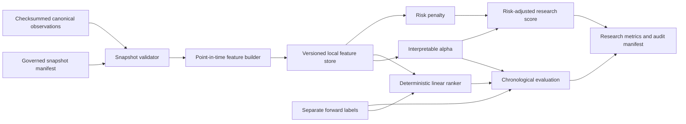

# GOAL-11 Quant Intelligence Architecture

## Status And Authority

- Goal: `GOAL-11: Quant Intelligence Foundation`
- Authority: GitHub Issue #39
- Mode: research only, non-actionable, deterministic
- Authoritative branch: `project-current`
- Delivery branch: `codex/goal11-quant-intelligence-foundation`
- Production promotion, recommendation, position sizing, portfolio weights,
  orders, broker integration, and trading remain locked.

This document is the Stage 1 architecture review required before GOAL-11
implementation. It defines the data and governance boundaries used by the
feature store, alpha research, deterministic ranking baseline, evaluation,
and risk-adjusted ranking layers.

## Existing Architecture Review

### Governed snapshots and market data

The current operational chain is:

1. The daily refresh validates a single-source Tencent-through-AKShare `qfq`
   batch and records provider, adjustment, PIT, and checksum evidence.
2. The operational position-management workflow consumes only a validated
   canonical refresh and emits an immutable research snapshot.
3. The committed historical canonical baseline contains close prices and
   one-day returns. Full dated refresh materializations are local deployment
   evidence and are intentionally ignored by Git.

The runtime provider contract can supply OHLCV, but the committed historical
canonical panel cannot. GOAL-11 therefore treats `close` as required and
`open`, `high`, `low`, `volume`, index context, and breadth context as optional
governed evidence. Missing optional evidence produces deterministic
availability codes and null features. It is never imputed or fabricated.

### Provenance and point-in-time controls

Existing snapshots expose immutable IDs, source checksums, cutoff dates,
provider lineage, and adjustment semantics. GOAL-11 adds a narrow adapter that
requires those values and validates all observations before feature
construction:

- unique `(date, symbol)` keys;
- observation date and `available_at` no later than the snapshot cutoff;
- date-grain v1 observations available on their observation date, with
  cross-date delayed availability rejected rather than backfilled;
- finite positive prices and non-negative volume where present;
- root-confined source paths;
- source checksum verification when a source file is loaded;
- no forward-return or label fields in feature inputs.

Labels remain a separate post-feature input. They may be joined only by the
evaluation layer after features have been generated and checksummed. A single
run rejects mixed feature snapshot/version/commit/adjustment lineage, and
score or label rows must match their feature row's snapshot lineage.

### Existing research and risk modules

The repository already contains goal-specific historical factor experiments,
risk diagnostics, regime labels, and review-only recommendation evidence.
Those artifacts remain historical evidence. GOAL-11 does not reinterpret them
as production-ready factors and does not increase `ready_factor_count` above
zero.

The new foundation provides reusable, versioned research contracts rather
than replacing or silently changing historical goal outputs. The risk layer
uses volatility, drawdown, instability, and a volume-based liquidity proxy
only when their evidence is available. Missing required risk evidence causes
score abstention.

### Experiment framework and recommendation locks

The existing experiment API is `PREPARED_NOT_STARTED`, and the current
workspace preserves exact deterministic behavior across 22 GET routes. Generic
dashboard, recommendation tiering, trading, broker, and production promotion
remain locked. GOAL-11 neither consumes recommendation outputs nor emits
actionable fields.

### Dashboard decision

Issue #39 makes the research dashboard optional when architecture permits it.
It is deferred in this goal because changing the current API payloads or
unlocking quant pages would break exact interface parity and blur the generic
dashboard lock. Feature Explorer, Alpha Explorer, and Model Evaluation may be
added only by a future explicit read-only interface goal. The foundation below
keeps its result contracts suitable for that future consumer without creating
routes or frontend pages now.

## Target Data Flow

All generated feature rows, labels, scores, model state, and evaluation data
are local runtime artifacts under an ignored output root. Only source code,
contracts, tests, and documentation are committed.

## Feature Store Contract

### Row identity and lineage

Every feature row contains:

- `symbol`
- `date`
- `feature_version`
- `source_snapshot_id`
- `generation_timestamp` copied from governed snapshot metadata
- `code_commit`
- `checksum` computed from canonical row JSON excluding `checksum`

Rows also carry `source_checksum`, `adjustment`,
`available_feature_families`, and deterministic `availability_reasons`.

### Pre-specified feature set

The version-1 windows and formulas are fixed in
`configs/quant/goal11_quant_intelligence_v1.json`.

| Family | Features | Evidence requirement |
| --- | --- | --- |
| Price | 1-day return; 5/20/60-day momentum; 5/20/60-day moving-average ratios; 20-day trend strength | close |
| Volatility | 20-day realized volatility; 20-day downside volatility; 60-day drawdown; 60-day volatility regime | close |
| Technical | RSI(14); MACD(12,26,9); Bollinger position(20,2); ATR(14) | close; ATR additionally needs high/low |
| Volume | 1-day volume change; 20-day abnormal volume; 20-day price-volume correlation | volume and close |
| Market regime | 20-day index trend; snapshot cross-sectional breadth; 20-day market volatility; deterministic regime label | governed index or consecutive aligned observed-symbol sets |

Feature calculations use observations no later than the row date. Warm-up
periods and absent evidence remain null with reason codes. Cross-sectional
breadth is calculated only from the same governed snapshot and date. Without
PIT-safe full-market constituent metadata, it is explicitly snapshot breadth:
the observed symbol sets must match on adjacent dates, and no full-market
coverage claim is made.

If a symbol disappears on a date that remains present for other symbols, its
rolling feature history resets when the symbol returns. This prevents returns
or technical windows from silently bridging a missing-date evidence gap.

The v1 feature date is also its availability date. Intraday timestamps on that
date are accepted, but delayed cross-date observations fail closed because a
date-only output cannot represent their later decision timestamp safely.

### Storage semantics

The feature store is immutable per run. It writes a stable CSV plus a JSON
manifest to a caller-supplied ignored/local directory. It refuses a non-empty
target run directory, refuses paths inside committed research evidence roots,
sorts rows deterministically, and records file checksums. Re-running the same
snapshot, version, commit, and generation timestamp produces byte-identical
artifacts.

## Alpha And Ranking Research Design

### Interpretable alpha

The pre-specified cross-sectional score is:

`alpha_score = momentum_component + trend_component + volume_strength_component - risk_penalty`

Momentum, trend, and volume strength are same-date winsor-free rank
percentiles centered on zero. Risk inputs are same-date rank percentiles on a
zero-to-one scale. The formula does not use labels. If a required component is
unavailable, the row abstains with an explicit reason rather than substituting
a constant.

### Deterministic linear ranking baseline

The comparison baseline is fixed-ridge linear regression implemented without
an external model dependency. It uses only pre-specified feature columns,
training-set standardization, a fixed ridge coefficient, and deterministic
Gaussian elimination. It is fitted on chronologically earlier labeled rows
and emits out-of-sample research scores only.

There is no random split, hyperparameter search, final-holdout tuning, model
binary, or production prediction endpoint. Fitted coefficients live only in
the local run result/manifest.

## Evaluation Design

Evaluation is chronological and label-separated:

- expanding-window split with an explicit minimum training-date count;
- walk-forward folds grouped by date;
- same-date IC and Rank IC, with mean, dispersion, and positive-rate stability;
- Precision@K and Recall@K using a pre-specified K;
- feature distribution stability by chronological fold, with availability
  carried separately in each feature row;
- ranking turnover based on successive top-K set changes;
- deterministic regeneration and input lineage checks.

Dates with insufficient labeled score cross-sections are skipped with an
explicit reason, while model rows with insufficient chronological training
abstain. No future observation may enter feature construction,
standardization, fitting, threshold selection, or score generation.

## Risk-Adjusted Research Score

The fixed version-1 penalty combines same-date normalized values for:

- realized volatility;
- drawdown magnitude;
- volatility-regime instability;
- inverse liquidity proxy from abnormal-volume evidence.

`risk_adjusted_score = alpha_score - risk_penalty`

This is a research ranking diagnostic only. Output contracts explicitly reject
fields representing buy/sell/hold, target price, target weight, position,
quantity, order, or execution action.

## Failure And Abstention Semantics

The foundation fails closed for invalid snapshot identity, checksum mismatch,
future-dated evidence, duplicate keys, labels in feature inputs, non-finite
required values, and unsafe output paths. It abstains at row/fold level for
normal scientific insufficiency such as warm-up history, missing OHLCV,
missing market context, incomplete risk inputs, or insufficient cross-section.

Reason codes are sorted and deterministic. No averaging across providers,
silent fallback, missing-value filling, or synthetic fundamentals is allowed.

## Production Boundary

GOAL-11 is implemented only when all of the following remain true:

- generated datasets, snapshots, logs, model binaries, notebooks, caches, and
  runtime artifacts are absent from the Git diff;
- `ready_factor_count` remains zero;
- existing 22 GET routes and their deterministic behavior remain unchanged;
- recommendation, position, portfolio, trading, broker, paper trading,
  production writes, and production model promotion stay locked;
- research scores contain no actionable output fields;
- the canonical validation, safety, workflow, adapter, PIT, leakage, and
  destructive-change audits pass.

## Dependency Decision

The implementation uses the Python standard library. This keeps the foundation
portable across Windows and macOS and avoids introducing a numerical or model
runtime dependency. A future explicit scaling goal may add a columnar backend
or a tree ranker after deterministic parity and governance contracts are
defined.
