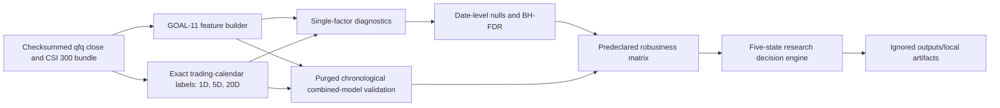

# GOAL-12 Alpha Validation Architecture

## Scope and locked boundary

GOAL-12 attempts to falsify the GOAL-11 feature, interpretable-alpha, and fixed
linear-ranking candidates. It is a local, deterministic, research-only layer.
It does not create recommendations, positions, weights, orders, equity curves,
production factors, or API/frontend behavior. Every decision emitted by this
goal carries `production_ready=false`; the production `ready_factor_count`
remains zero.

The authoritative base is `25273bb3d3cf9d6eb6c21caf1317c5c56f086489`.
GOAL-12 preserves the 14 canonical interfaces, 22 GET routes, zero write
routes, Tencent operational provider contract, qfq policy, amount-null policy,
and GOAL-11 byte-stability protections.

## Stage 0 architecture and data audit

GOAL-11 defines 25 feature columns in `goal11_features_v1`, an interpretable
same-date rank score, a second risk-adjusted score, and a fixed seven-feature
ridge ranker. The baseline uses a fixed ridge coefficient, chronological
training, training-only standardization, and no hyperparameter search. GOAL-12
does not change those candidate definitions.

The eligible committed historical input is the checksummed
`outputs/research/network_ingestion` bundle:

- 34,543 equity close rows across 843 observed trading dates;
- 41 acquired symbols, with 823 dates containing 41 rows and 20 containing 40;
- 2 symbols with 833 dates and 39 with 843 dates;
- 3 index series, with CSI 300 fixed as the GOAL-12 calendar/context series;
- explicit AKShare/Sina acquisition using `adjust="qfq"`;
- one current-listing universe, so survivorship risk is disclosed;
- close-only equity history: no historical open/high/low/volume/amount fields.

The bundle therefore supports 17 stock-varying numeric GOAL-11 features from
close history. ATR and three volume features lack required evidence. The four
market-regime columns are date-level context and cannot have cross-sectional
IC on a single date. The GOAL-11 alpha and fixed ranker both require abnormal
volume; unless another governed complete source is supplied, they must abstain
rather than substitute or impute structural absence.

The historical source has no amount column. GOAL-12 records this as
`UNAVAILABLE_NULL_NOT_ZERO`; it never copies volume into amount and never
represents unavailable amount as zero.

The machine-readable data audit records the full and common-horizon eligible
feature ranges, eligible-date symbol-breadth minimum/median/maximum and
distribution, feature missingness, and available/missing label counts plus
realizable feature/label date ranges for every horizon.

## Data flow

## Provenance and artifacts

The loader verifies the evidence-bundle file checksums, required provider,
unique symbol/date keys, positive finite prices, selected index uniqueness,
PIT declarations, and the qfq acquisition call. It constructs no network
request. Source bytes, configuration, code commit, row lineage, and artifact
checksums are recorded in the local run manifest.

Full features, labels, null draws, fold diagnostics, model scores, robustness
tables, and decisions are written only below `outputs/local/goal12/`, which is
ignored by Git. The writer is immutable per run and produces canonical sorted
JSON/CSV bytes. Git contains only code, contracts, tests, methodology, and a
concise findings report.

## Failure semantics

Duplicate or ambiguous joins, source-checksum drift, non-qfq input, shortened
horizons, future feature access, test-fitted preprocessing, random date splits,
non-finite values, unsafe output paths, and actionable output fields fail
closed. Ordinary warm-up, structural source absence, sparse slices, and
insufficient breadth produce explicit research-insufficiency records.
